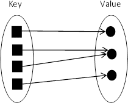
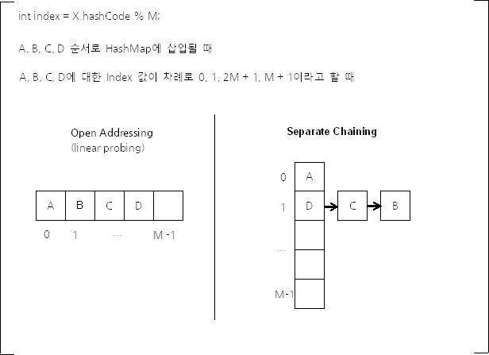

### HashMap

- Key-Value 구조를 가지고 있는 맵을 해쉬로 구현한 자료구조 입니다.
- Hash 함수를 사용해, 키 값을 정수로 변환한 후에, 해당 정수를 인덱스로 배열에 값을 저장합니다.
- 배열과 같은 동작 방식이므로 조회의 시간 복잡도는 $O(1)$ 입니다.

### HashMap의 장단점

- 배열과 해쉬를 이용하여 대량의 데이터를 효율적으로 저장 및 조회를 할 수 있습니다.
- 중복된 키는 허용하지 않지만, 중복된 값은 허용됩니다.
- 해쉬함수를 사용함으로 필연적으로 발생하는 해쉬 충돌이 일어날 수 있습니다. 이 때 해쉬충돌을 해결하기 위해 2가지 방법을 사용합니다.
    

- Open Addressing
    - 해쉬 충돌이 발생한 경우, 해당 주소로부터 고정 폭 만큼 이동하여 저장하는 방법입니다.
- Chaining
    - 해쉬 충돌이 발생한 경우, 해당 버킷에서 Linked List 형식으로 다음 값을 이어주는 방법입니다.

출처 : 이것이 자료구조+알고리즘이다

출처 : https://d2.naver.com/helloworld/831311