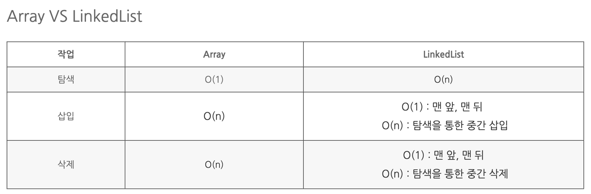

## [Data Structure] LinkedList 와 ArrayList의 차이점에 대해 설명해주세요

### ArrayList
- ArrayList 각 데이터에 index가 있어서 원하는 노드의 인덱스를 알때 접근이 빠른다
- Array List는 무작위 접근이 가능하다
- ArrayList는 대량의 데이터에 대하여 추가/삭제에는 불리하고, 참조에는 유리하다.

#### 시간 복잡도
- get, set : index접근 방식이기때문에 접근 속도가 빠르고 O(1)의 복잡도를 가진다.
- add, remove : O(n)
  - add 의 경우는 삽이할 위치의 인덱스 뒤를 모두 미루는 연산이 필요해서 o(n)이 필요하다.
  - remove는 삽입할 위치의 인덱스 뒤의 모든 값은 한 칸씩 앞으로 당기는 연산이 필요하다.

### LinkedList
- LinkedList에서는 순차 접근만이 가능
- LinkedList는 대량의 데이터에 대하여 참조에는 불리하고, 추가/삭제에는 유리하다
- 자바의 경우 링크드 LinkedList는 양방향 연결 리스트를 활용해 구현한다(이전 노드와 이후 노드에 대해 서로 연결되어 있다)

#### 시간 복잡도
- get, set 순차적 접근 방식이기때문에 O(n)의 복잡도
- add, remove : O(n) 
  - 해당 인덱스 까지 찾아가기 위해서 O(n)이 필요하다.
  - 만약 tail 이나 head에 추가하는경우 O(1)이다.

### 결론

- ArrayList는 배열에 인덱스가 있어 검색이 빠르지만 만약 삽입 삭제를 하는경우엔는 관련 데이터를 모두 이동시켜야 해서 안좋다. 
- LinkedList는 인덱스가 없어 순차적 접근이 필요해서 찾아가는 과정이 O(n)이 필요하고 수정, 삭제 자체는 O(1)이 든다.

### 출처, 참고
[출처](https://hee96-story.tistory.com/46)  
[doubly linked list 참고1](https://opentutorials.org/module/1335/8941)  
[doubly linked list 참고2](https://inpa.tistory.com/entry/JAVA-%E2%98%95-LinkedList-%EA%B5%AC%EC%A1%B0-%EC%82%AC%EC%9A%A9%EB%B2%95-%EC%99%84%EB%B2%BD-%EC%A0%95%EB%B3%B5%ED%95%98%EA%B8%B0) 