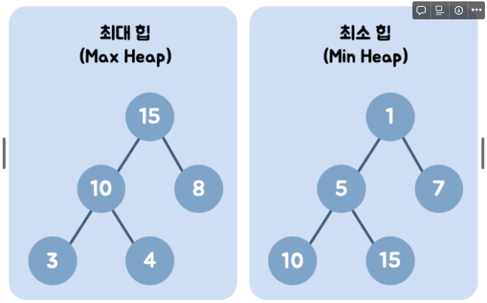
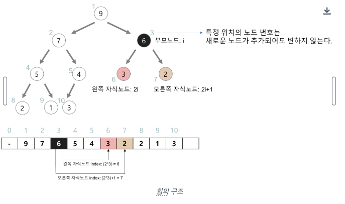

# 힙의 개념

- 힙은 최댓값 및 최솟값을 찾아내는 연산을 빠르게 하기 위해 고안된 완전이진트리(complete binary tree)입니다.
- 방식에 따라 최댓값을 구하는 최대힙과 최솟값을 구하는 최소힙으로 나눌 수 있습니다.

# 힙의 구조

- 왼쪽 자식 : 부모 인덱스 * 2
- 오른쪽 자식 : 부모 인덱스 * 2 +1
- 부모 인덱스 : 자식 인덱스 / 2

# 동작 과정
- 모든 동작 과정은 최소힙을 기준으로 합니다.

### 삽입
1. 힙의 최하단 왼쪽에 노드를 삽입합니다.
2. 해당 노드를 부모와 비교하며 부모보다 작다면 자리를 바꿉니다.
3. 2번 과정을 부모가 더이상 없거나 부모보다 작지 않을 때까지 반복합니다.
4. 기존에 최소힙을 만족하는 자료구조라는 가정하에 이 과정을 거친 배열은 최소힙이 됩니다.

### 삭제
1. 힙의 최상단 노드를 삭제합니다.
2. 힙의 최하단 왼쪽 노드를 최상단으로 올립니다.
3. 자식 노드들과 비교하며 더 작은 노드가 위로 올라오며 최소 노드가 루트 노드가 됩니다.

# 특징

### 장점
- 기본 배열에서 최댓값과 최솟값을 찾기 위해서는 O(N)이 소요되는 반면 힙에서는 O(1)만에 찾을 수 있습니다.
  - 힙 규칙을 만족하는 배열에서 최대, 최솟값을 꺼냄 : O(1)
  - 최대, 최소 값을 루트노드에 위치시킴 : O(logN)

### 단점
- 루트 노드에 대한 연산만을 진행할 수 있습니다.
- 최대 최소 값을 찾는 데에 특화된 자료구조이기 때문에 중간값을 찾거나 정렬된 순서에 대한 접근이 어렵습니다.
- 기본 배열은 삭제 및 수정에 O(1)이 소요되지만 힙은 O(logN)이 소요됩니다.

## 참고 자료
> https://gmlwjd9405.github.io/2018/05/10/data-structure-heap.html
