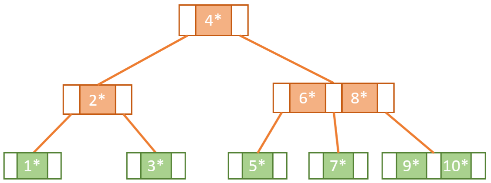
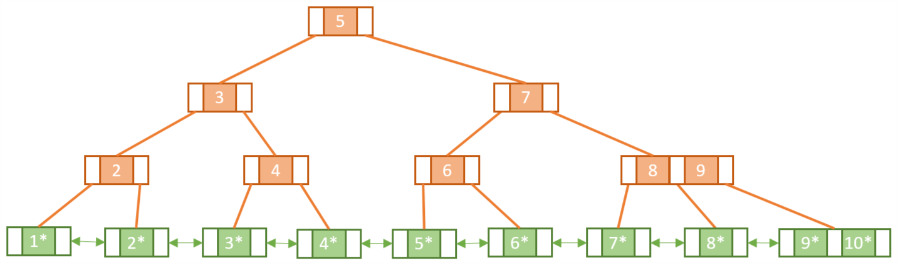

### B-Tree

- Self-Balancing Tree의 하나로 inorder의 순서대로 노드를 정렬합니다.
- B-Tree의 높이는 노드의 삽입과 삭제가 이루어질 때마다 자동적으로 변경됩니다.
- B-Tree에서는 가장 작은 값이 왼쪽에 정렬되며, 가장 높은 값은 오른쪽에 정렬됩니다.

B-Tree의 구조

### B+Tree

- B+ Tree는 기존 B-Tree에서 가지는 단점을 보완하기 위한 자료구조로, 모든 단말노드는 Doubly Linked로 연결되어있습니다.

B+Tree

출처 : https://www.geeksforgeeks.org/difference-between-b-tree-and-b-tree/

출처 : https://www.baeldung.com/cs/b-trees-vs-btrees