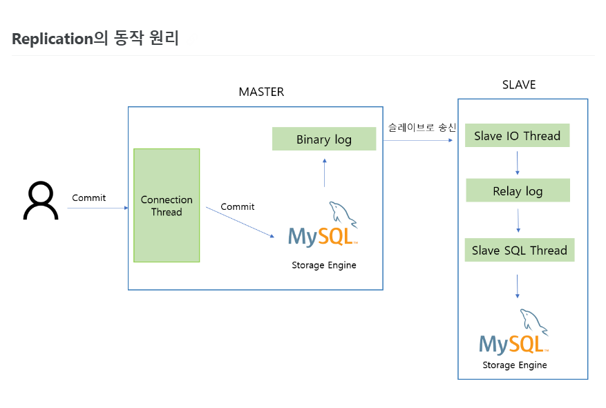

데이터베이스 서버를 2대 이상 두어서, 고가용성을 목표로 하는 구조이다.

장애 상황에서 서버가 다운되더라도, 예비 서버를 통해 서비스를 정상적으로 수행 할 수 있다.

MySQL에서는 Replication을 통해 이중화를 구현할 수 있다.

1. 클라이언트가 Commit 을 누르면 먼저 Master 서버에 존재하는Binary log 에 변경사항을 모두 기록합니다.
2. Master Thread 는 비동기적으로 (복사되는 시간을 기다려주지 않습니다)Binary log를 읽어 Slave 서버로 전송합니다.
3. Slave 의 I/O Thread 는 Master로 부터 받은 변경 데이터들을Relay log 에 기록을 합니다.
4. Slave의 SQL Thread 는 Replay log의 기록들을 읽어 자신의 스토리지 엔진에 최종적용합니다.