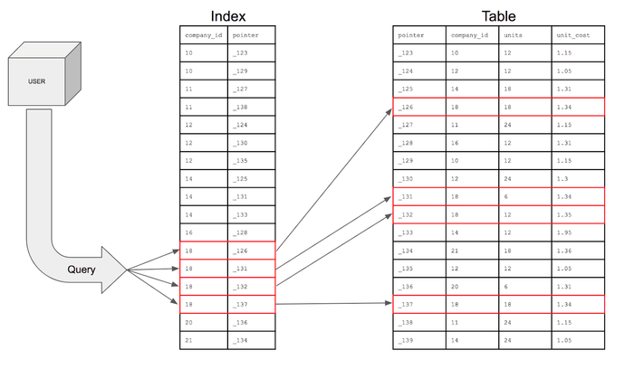
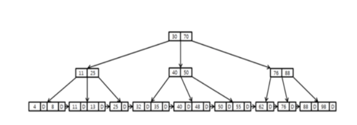

## [Database]인덱스에 대해 설명해주세요

### 인덱스에 대해 설명해주세요.

- 데이터 검색 시 속도 향상을 위한 객체이다.  
- 테이블의 모든 데이터를 검색하면 시간이 오래걸리기 때문에 데이터와 데이터의 위치를 포함한 자료구조를 생성하여 빠르게 조회할 수 있도록 돕고 있다.
- DB 데이터의 주소를 갖고 있다.
- 데이터베이스의 index는 책의 색인과 같다.
- 만약 index를 적용하지 않은 컬럼을 조회한다면, 전체를 탐색하는 Full Scan이 수행된다.
  - Full Scan은 전체를 비교하여 탐색하기 때문에 처리 속도가 떨어진다.

### 인덱스의 장단점
#### 장점 :
- 테이블 검색 속도와 성능 향상(SELECT, 효율적 검색)
- 인덱스에 의해 데이터들이 정렬된 형태를 갖는다.

#### 단점 :
- 인덱스를 관리하기 위한 추가 작업이 필요하다.
- 추가 저장공간이 필요하다.
- 잘못 사용하는 경우 오히려 성능 저하 발생(데이터 변경이 많은 경우(Delete, Update연산) 오히려 성능 저하 발생)

---

### 인덱스의 자료구조
#### 해시테이블
- key와 value를 한 쌍으로 데이터를 저장하는 자료구조이다. (key,value) = (컬럼의 값, 데이터의 위치)
- 평균적으로 O(1)으로 빠른 시간 만에 원하는 데이터를 탐색할 수 있는 구조이다.
- 실제로 인덱스에서 잘 사용되지는 않는다.

#### B+ Tree

- 어느 한 데이터의 검색은 효율적이지만, 모든 데이터를 한 번 순회하는 데에는 트리의 모든 노드를 방문해야 하므로 비효율적이다. 이러한 B-Tree의 단점을 개선시킨 자료구조가 B+Tree이다.
- B+Tree는 오직 leaf node에만 데이터를 저장하고 leaf node가 아닌 node에서는 자식 포인터만 저장한다. ⇒ B-tree에 비해 메모리를 더 확보할 수 있다.
- BTree의 리프노드들을 LinkedList로 연결하여 순차 검색을 용이하게 한다.
- O(logN)의 시간복잡도.
- 해시함수는 등호(=) 연산에만 특화되었기 때문에 부등호 연산(<,>)이 자주 사용되는 데이터베이스 검색을 위해서는 해시테이블이 적합하지 않기 때문에 B+Tree 방식을 많이 사용한다.

---

### 추가사항 
#### 인덱스를 사용하면 좋은 컬럼
- 값 범위가 넓은 컬럼(컬럼 내의 값이 다양한 것) → unique, primary, 유일한!!
- join, where에서 자주 언급되는 컬럼
- 쿼리를 했을 때 통상 전체 데이터의 2~4% 이내의 데이터

#### 인덱스 종류
- 사용자 정의 인덱스 : create index 인덱스이름 on 테이블이름(column_name);
- 미리 정의된 키(PK)는 자동으로 인덱스 구성
- constraint ~ : 명시적으로

```
인덱스를 사용하는 것 만큼이나 생성된 인덱스를 관리해주는 것도 중요하다.   
그러므로 사용되지 않는 인덱스는 바로 제거를 해주어야 한다.
```


### 참고/출처
[인덱스 자료 구조](https://velog.io/@sem/DB-%EC%9D%B8%EB%8D%B1%EC%8A%A4-%EC%9E%90%EB%A3%8C-%EA%B5%AC%EC%A1%B0-B-Tree)  
[인덱스(index)란?](https://mangkyu.tistory.com/96)  