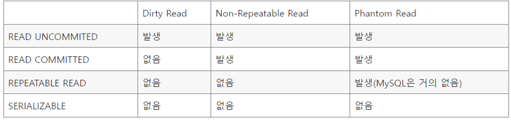

# 트랜잭션의 격리 수준 (Transaction Isolation Level)

- 트랜잭션의 격리 수준이란 여러 트랜잭션이 동시에 처리될 때, 특정 트랜잭션이 다른 트랜잭션에 서 변경하거나 조회하는 데이터를 볼 수 있게 허용할지 여부를 결정하는 것이다.
- 트랜잭션의 격리 수준은 격리(고립) 수준이 높은 순서대로 SERIALIZABLE, REPEATBLE READ, COMMITTED, READ UNCOMMITED가 존재한다.

## SERIALIZABLE

- 가장 엄격한 격리 수준으로, 이름 그대로 트랜잭션을 순차적으로 진행시킨다.
- 여러 트랜잭션이 동일한 레코드에 동시 접근할 수 없으므로, 데이터 부정합 문제는 발생하지 않는다.
- 트랜잭션이 순차적으로 처리되어야 하므로 동시 처리 성능이 매우 떨어진다.
- 순수한 SELECT 작업에서도 대상 레코드에 넥스트 키 락을 읽기 잠금(공유락, SharedLock)으로 건다.
    - 한 트랜잭션에서 넥스트 키 락이 걸린 레코드를 다른 트랜잭션에서는 절대 추가, 수정, 삭제할 수 없다.
    - SERIALIZABLE은 가장 안전하지만 가장 성능이 떨어지므로 극단적으로 안전한 작업이 필요한 경우가 아니라면 사용해서는 안 된다.

## REPEATABLE READ

- MySQL의 InnoDB 스토리지 엔진에서 기본적으로 사용되는 격리 수준이다.
- InnoDB 스토리지 엔진을 사용할 경우 PHANTOM READ 부정합이 발생하지 않는다.
- 어떤 트랜잭션이 읽은 데이터를 다른 트랜잭션이 수정하더라도 동일한 결과를 반환할 것을 보장한다.
    - MVCC를 통해 동일성 보장

## READ COMMITTED

- 커밋된 데이터만 조회할 수 있다.
    - READ COMMITTED는 REPEATABLE READ에서 발생하는 Phantom Read에 더해, Non-Repeatable Read(반복 읽기 불가능) 문제까지 발생한다.

## READ UNCOMMITTED

- 커밋하지 않은 데이터 조차도 접근할 수 있는 격리 수준이다.
- 다른 트랜잭션의 작업이 커밋 또는 롤백되지 않아도 즉시 보이게 된다.
    - 어떤 트랜잭션의 작업이 완료되지 않았는데도, 다른 트랜잭션에서 볼 수 있는 부정합 문제를 Dirty Read(오손 읽기)라고 한다.
    - Dirty Read는 데이터가 조회되었다가 사라지는 현상을 초래하므로 시스템에 상당한 혼란을 주게 된다.

### MySQL을 사용한다면 최소한 READ COMMITTED 이상의 격리 수준을 사용해야 한다.

## 트랜잭션의 격리 수준 (Transaction Isolation Level) 요약

- READ UNCOMMITTED는 부정합 문제가 지나치게 발생한다.
- SERIALIZABLE은 동시성이 상당히 떨어지므로 READ COMMITTED 또는 REPEATABLE READ를 사용하면 된다.
    - 오라클 기본: READ COMMITTED, MySQL 기본: REPEATABLE READ

- SERIALIZABLE이 아니라면 크게 성능 개선 및 저하는 발생하지 않는다.
    - 그 이유는 언두 로그를 통해 레코드를 참조하는 과정이 거의 동일하기 때문이다.
- MySQL은 갭 락을 통해 Phantom Read까지 거의 발생하지 않고, READ COMMITTED보다는 동시 처리 성능은 뛰어난 REPEATABLE READ를 사용한다.