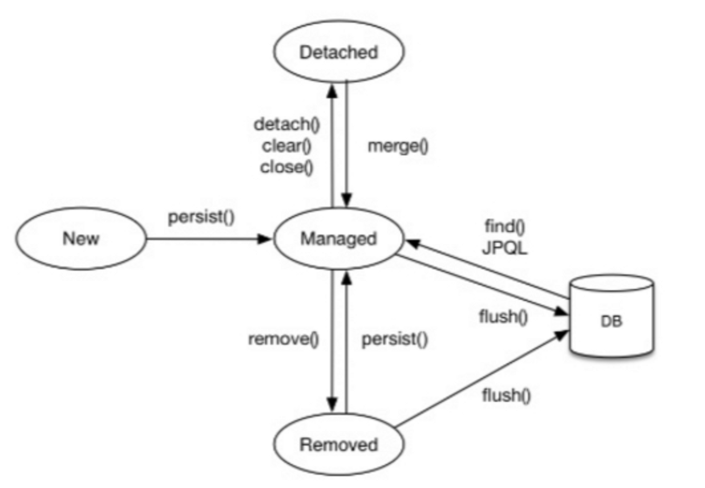

## 종류
### 비영속 
- 순수한 객체 상태로, [영속성 컨텍스트](%EC%98%81%EC%86%8D%EC%84%B1%20%EC%BB%A8%ED%85%8D%EC%8A%A4%ED%8A%B8.md)와 관련이 없는 상태
```java
Member member = new Member();
```
### 영속
- 엔티티 매니저를 통해 엔티티를 영속성 컨텍스트에 저장하여 영속성 컨텍스트가 객체를 관리하는 상태 
- 영속성 컨텍스트에 저장된 엔티티는 1차 캐시에서 관리되고, 같은 트랜잭션에서 동일한 엔티티를 다시 조회할 경우 1차 캐시에서 조회합니다.
```java
// EntityManager를 사용하여 Member 엔티티를 저장한 상태
EntityManager entityManager = entityManagerFactory.createEntityManager();

entityManager.persist(member); // 저장
```
### 준영속
- 영속성 컨텍스트에 저장되었다가 분리된 상태
- 영속성 컨텍스트가 제공하는 1차 캐시, 쓰기 지연 SQL 저장소, [변경 감지 기능(더티체킹)](%EB%B3%80%EA%B2%BD%20%EA%B0%90%EC%A7%80.md)을 사용하지 못합니다.
- 식별값을 가지고 있습니다.
```java
// 엔티티를 영속성 컨텍스트에서 분리해 준영속 상태로 만든다.
em.detach(member);

// 영속성 콘텍스트를 비워도 관리되던 엔티티는 준영속 상태가 된다.
em.claer(); //영속성 콘텍스트 초기화(새로 만드 em과 같은 상태 - 캐싱되지 않은 결과에서 찾고 싶은경우 좋다.)

// 영속성 콘텍스트를 종료해도 관리되던 엔티티는 준영속 상태가 된다.
em.close(); //영속성 컨텍스트를 종료하고 관리하던 모든 엔티티가 준영속 상태가 된다
```
### 삭제
- 엔티티를 영속성 컨텍스트와 데이터베이스에서 삭제한 상태  
```java
// EntityManager를 사용하여 Member 엔티티를 삭제한 상태
entityManager.getTransaction().begin();
entityManager.remove(member); // 삭제
entityManager.getTransaction().commit(); // 커밋
``
