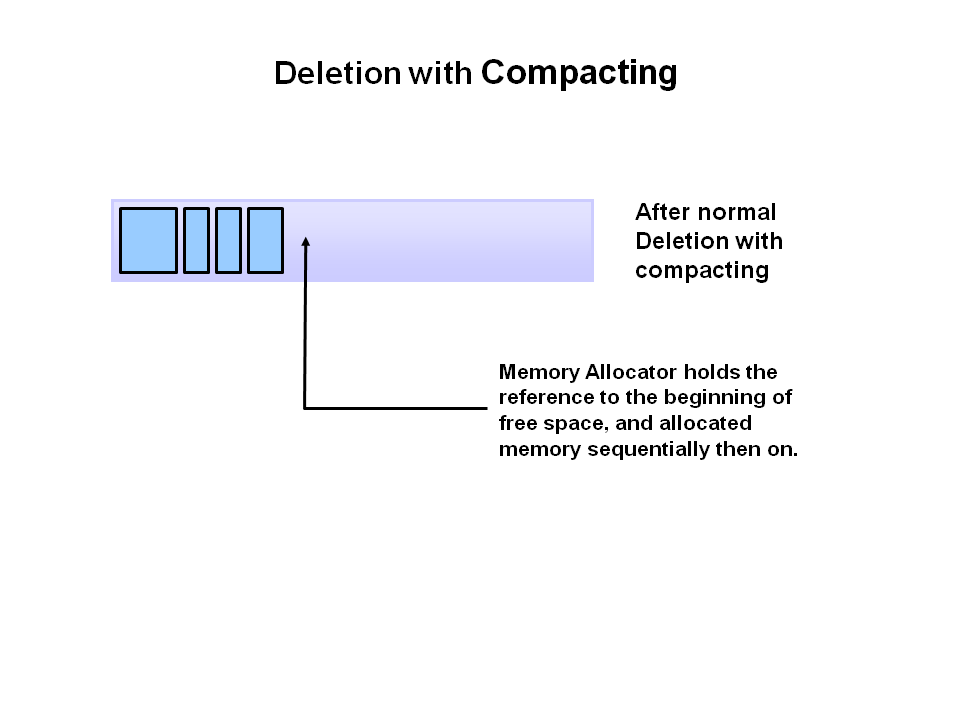
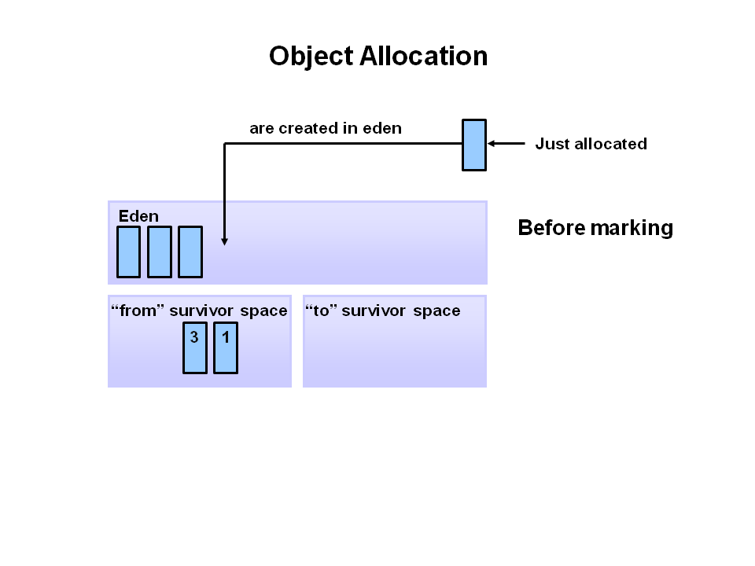
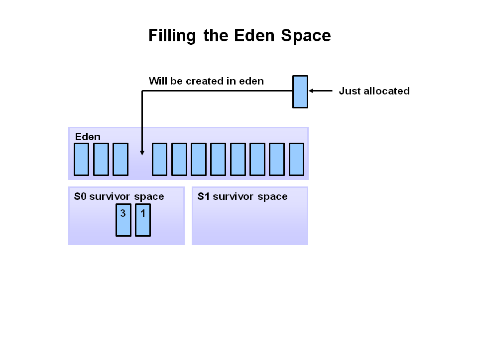
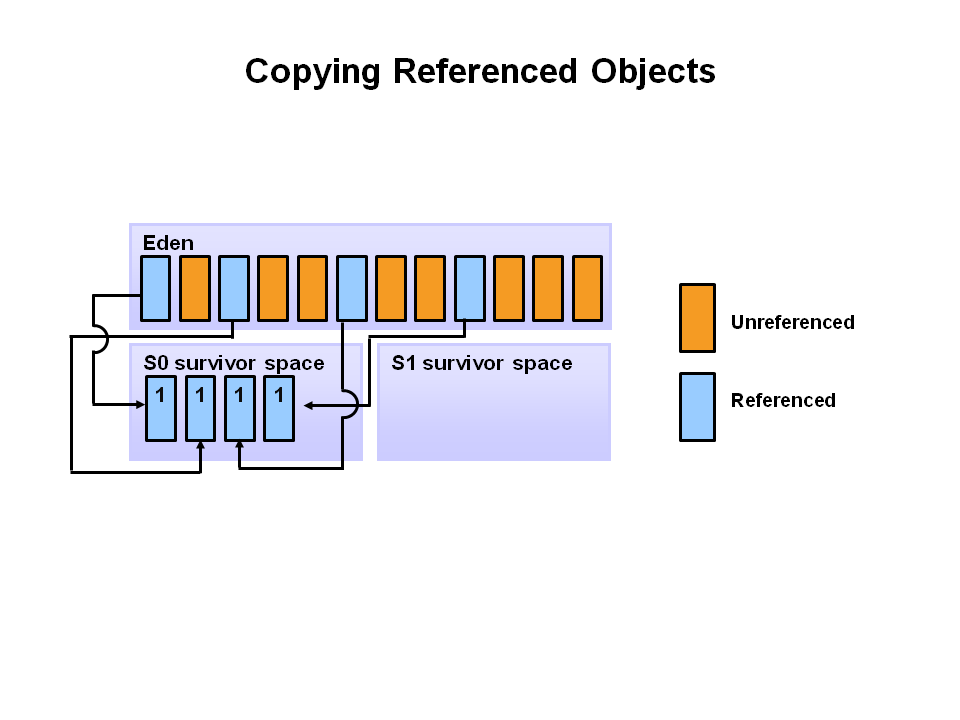
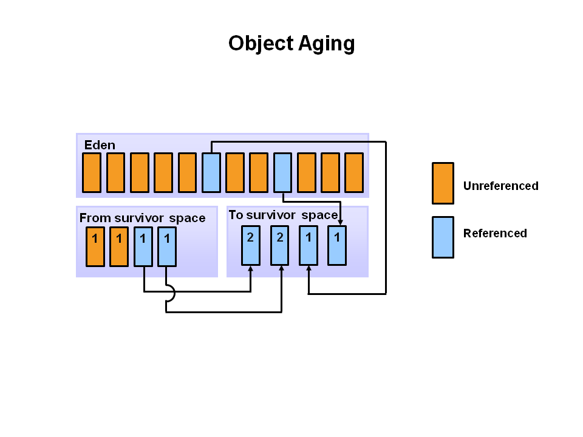
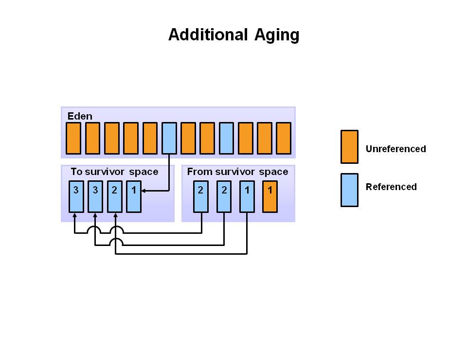
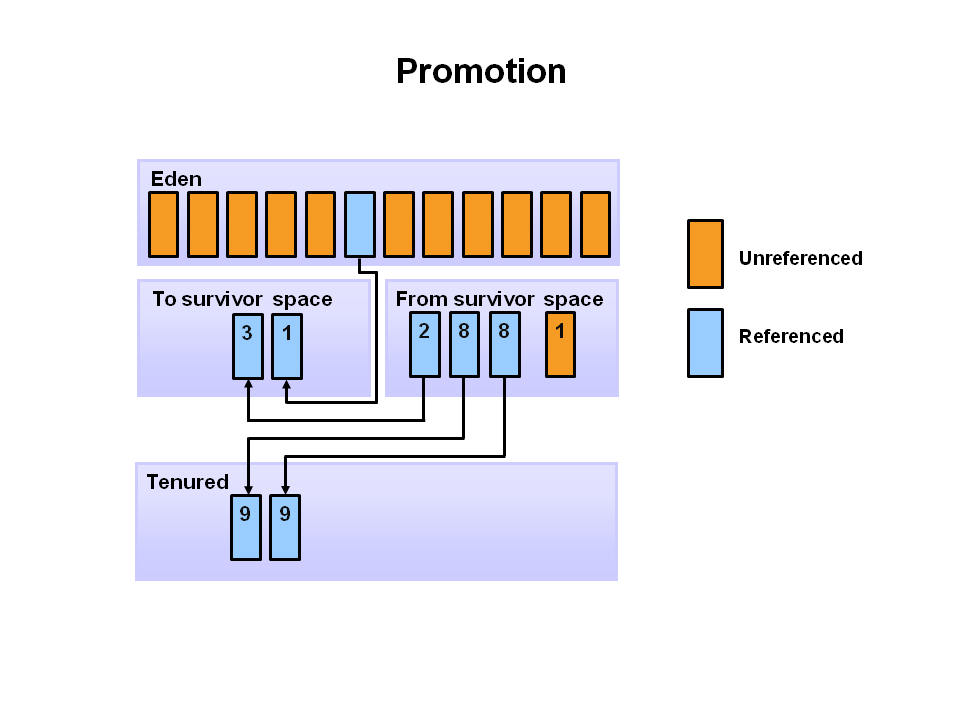
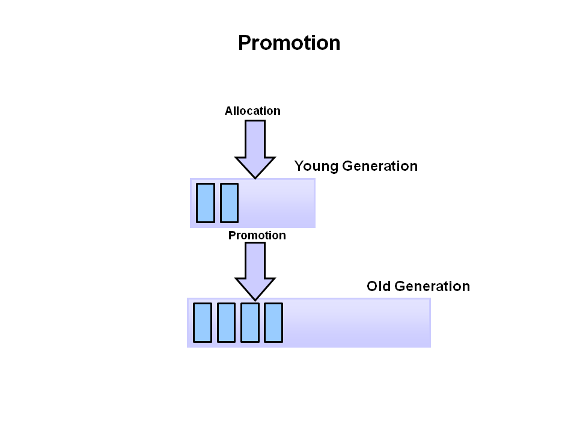
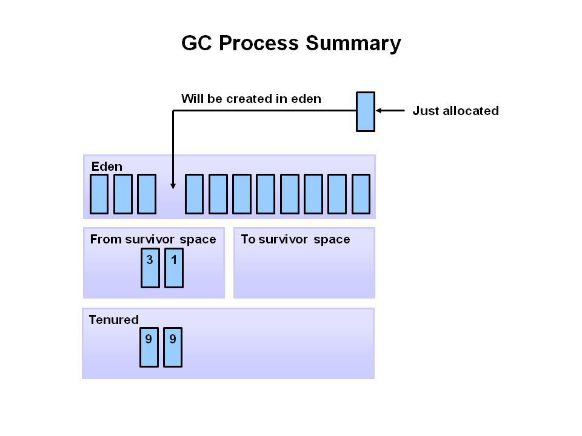

- 가비지 컬렉터(Garbage Collector)란 메모리에 사용되지 않는 메모리를 탐색하고, 해당 자원을 회수하기 위한 가비지 컬렉션을 수행하는 프로그램입니다.

- 가비지 컬렉션이 수행되는 프로세스는 다음과 같습니다.

## 1. 마킹 (Marking)

    - 힙 영역에 존재하는 모든 객체를 대상으로, 스캔을 진행합니다.

    - 이때 객체를 레퍼런스하는 경우와 레퍼런스 하지 않는 경우로 나누어서 구분합니다.

.png)

## 2. 일반 삭제 (Normal Deletion)

    - 일반 삭제를 통해 레퍼런스가 존재하지 않는 객체를 사용 가능한 공간으로 분류합니다.

    - 이후 메모리 할당자 (Memory Allocator)에 의해 사용 가능한 공간에 새로운 객체나 포인터등을 할당하게 됩니다.

### 2-a 삭제와 압축 (Deletion with Compacting)

    - 추후 메모리 사용 시 성능 향상을 위해, 삭제 후 남아있는 공간을 압축하는 과정을 추가적으로 수행할 수 있습니다.

    - 사용 중인 메모리의 공간을 하나의 공간에 일렬로 담아 이동시킴으로 이 과정을 효율적으로 수행할 수 있습니다.

---

- JVM은 Generational Garbage Collection 기법을 사용하는데, 이는 메모리에 할당된  대부분의 객체는 주로 짧은 생명주기를 가지고 있기 때문입니다.

- 이러한 생명주기를 잘 보여주는 그래프로, Y축은 사용된 메모리 공간을 의미하고, X축은 객체의 생명주기를 나타냅니다.

- Generational Garabage Collection 기법으로 Heap의 구조는 다음과 같이 구성되어 있습니다.

## Young Generation

- 새로운 객체가 할당되고, 나이를 들어가는 공간입니다.

- Yong Generation의 공간이 모두 할당 되었을 경우, Minor GC를 발생시킵니다.

    > Minor GC 발생되면 Stop the World 이벤트가 수행됩니다. 이벤트가 수행되면, 실행 중이던 모든 쓰레드가 중지하고 이벤트 종료까지 대기합니다. 이 때 객체의 수명이 길지 않다는 점을 통해 Minor GC를 최적화 시킬 수 있고, 해당 공간은 빠르게 회수됩니다.

- 이 공간에서 오래 살아남은 객체는 Old Generation으로 이동하게 됩니다.

## Old Generation

- Yong Generation에서 객체가 특정 나이까지 생존할 경우, 이동하게 되는 공간입니다.

- Old Generation도 GC를 수행하게 되는데, 이 때 수행되는 GC를 Major GC라고 합니다.

    > Major GC 역시 Stop the World 이벤트를 수행하게 됩니다. 살아 있는 모든 객체를 포함하여 수행하기 때문에, Minor GC에 비해 느리게 수행됩니다. 반응성이 중요한 어플리케이션의 경우 Major GC의 발생 빈도를 최소한으로 목표하고 설계하는 것이 중요합니다. 또한 Old Generation을 관리하는 GC의 종류에 따라 Stop the World 이벤트의 기간도 영향을 받습니다.

## Permanent Generation

- 어플리케이션을 실행하기 위해 필요한 클래스나 메소드와 같은 메타 데이터를 저정하는 공간입니다.

- Permanent Generation은 JVM에 의해 사용중인 어플리케이션 클래스를 기반으로 채워집니다.

- 추가적인 공간이 필요해지거나, 사용하지 않는 클래스의 경우 Full GC에 의해 회수 될 수 있습니다.

## Generational Garbage Collection 수행 과정

1. 새롭게 생성된 객체가 eden 공간에 할당 됩니다.

2. eden 공간이 모두 할당 될 경우, minor GC가 수행됩니다

3. 레퍼런스가 있는 객체들은 eden에서 survivor 공간으로 이동하고, 나머지 레퍼런스가 없는 객체들은 삭제됩니다. 이 때 eden 공간은 다시 비워지게 됩니다.

4. S0 survivor 공간에서 Minor GC가 수행되면, 객체들은 다시 나이를 먹고 S1 survivor 공간으로 이동하게 됩니다.

5. 다음 Minor GC가 수행될 때는, S0 과 S1이 바뀌게 됩니다. 레퍼런스 객체들은 S0로 이동하게 되고, 나이를 먹게됩니다. 이 때 S1과 eden은 정리되었습니다.

6. Minor GC를 수행하는 과정에서, 객체가 특정 나이에 도달하게 되면 (그림에서는 8) 진급이 수행됩니다. 진급(Promotion)은 Yong Generation에서 Old Generation으로 이동하는 과정을 말합니다.

7. Minor GC를 수행하면서, 점차 객체들이 진급을 통해 Old Generation의 공간에 쌓입니다.

8. Old Generation이 가득 찰 경우 Major GC를 수행하여, 공간을 정리하게 됩니다.

[출처](https://www.oracle.com/webfolder/technetwork/tutorials/obe/java/gc01/index.html)