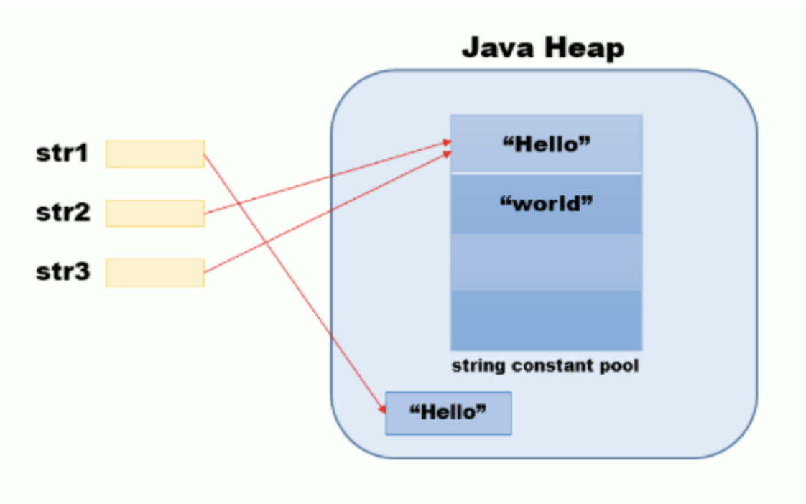

> 두 방식의 근본적인 차이는 저장되는 저장공간의 차이

### 리터럴(Literal) 생성
- 리터럴(Literal)을 사용하는 경우에는 **String constant pool**이라는 영역에 생성
  - **String constant pool**의 위치는 자바 7부터 `Perm 영역` ➡️`Heap 영역`으로 옮겨짐
- 만약 같은 값을 새로 생성할 때 **String constant pool**에 이미 존재한다면 생성되는 객체는 이미 존재하고 있는 값을 참조
- 특히, String의 불변성(Immutable)은 문자열 비교와 같은 연산의 안정성을 위해 Literal 방식을 사용하는것을 추천

> #### String의 불변성이란?<br>
> 자바에서 String은 불변 객체(immutable)라고 한다. 즉, 객체 생성 이후 내부의 상태가 변하지 않는 객체라는 뜻
> ```java
> String str = "CSI";
> str = "CSI2";
> ```
> str 이라는 String 객체가 생성된 이후 "CSI"를 "CSI2" 로 바꾼다고 해도 실제 내부적으로는 최초 생성된 String 객체의 값이 변경되는 것이 아니라 **새로운 String 객체가 생성, 그 참조가 str 변수에 할당된 것**<br>
> 즉, 불변성이란 문자열을 재할당할 때 해당 문자열을 참조하는 객체를 수정하는 것이 아니라 새 문자열을 만들고, 변경된 문자열을 할당한다는 것

### new String() 생성
- **new 연산자**를 사용하여 String을 생성하게 되면 객체로 생성이 되어 Heap메모리 영역에 저장
- new 연산자로 생성한 String 객체는 같은 값이 **String pool**에 존재하더라도, **Heap 영역**에 별도로 객체를 생성

아래 예시를 통해 살펴보자.

```java
String str1 = new String("Hello");
String str2 = "Hello";
String str3 = "Hello";
```
위의 코드에 의해 생성되는 객체는 아래 그림과 같이 생성된다.



리터럴(Literal)로 생성한 `str2`와 `str3`은 동일한 객체를 바라보지만, new String()으로 생성한 `str1`은 다른 메모리 주소의 객체를 바라봄

[참고 문헌 1](https://yeoonjae.tistory.com/entry/Java-String-literal-%EA%B3%BC-new-String-%EC%9D%98-%EC%B0%A8%EC%9D%B4)<br>
[참고 문헌 2](https://velog.io/@mooh2jj/%EC%9E%90%EB%B0%94%EC%9D%98-String-%EC%83%9D%EC%84%B1-%EB%B0%A9%EC%8B%9D-%EB%A6%AC%ED%84%B0%EB%9F%B4%EB%B0%A9%EC%8B%9D-vs-new-%EC%97%B0%EC%82%B0%EC%9E%90-%EB%B0%A9%EC%8B%9D)<br>
[참고 문헌 3](https://velog.io/@mooh2jj/%EC%9E%90%EB%B0%94%EC%9D%98-String-%EC%83%9D%EC%84%B1-%EB%B0%A9%EC%8B%9D-%EB%A6%AC%ED%84%B0%EB%9F%B4%EB%B0%A9%EC%8B%9D-vs-new-%EC%97%B0%EC%82%B0%EC%9E%90-%EB%B0%A9%EC%8B%9D)