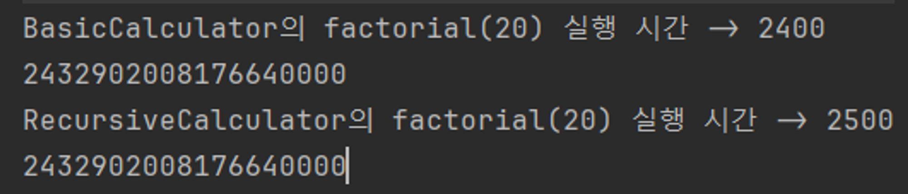
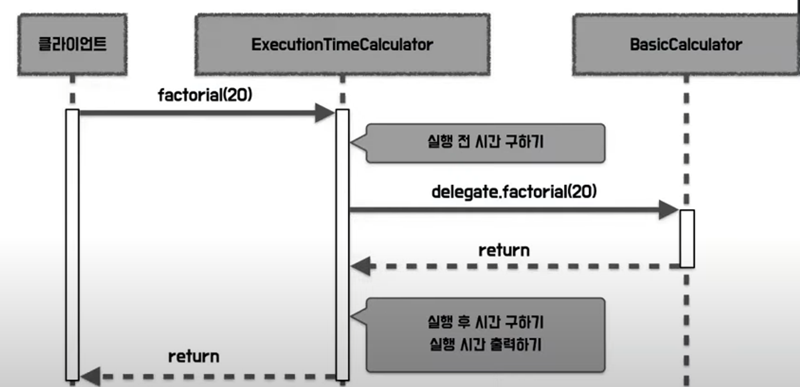
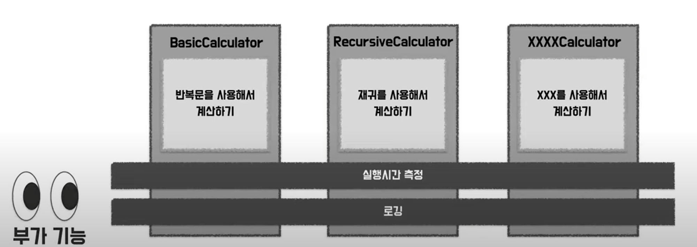
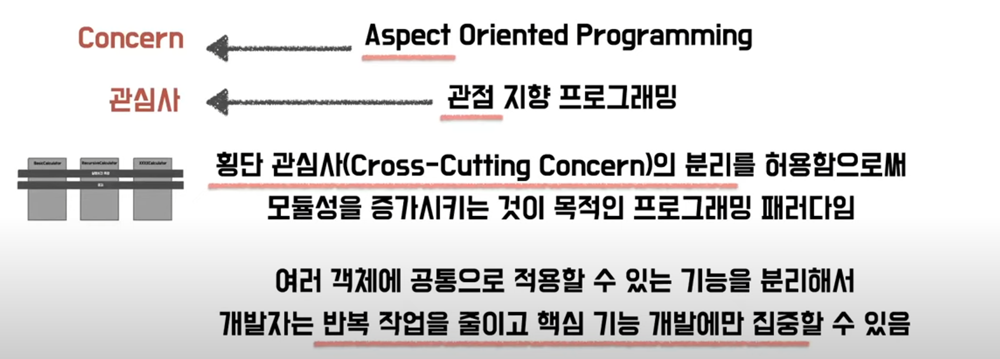
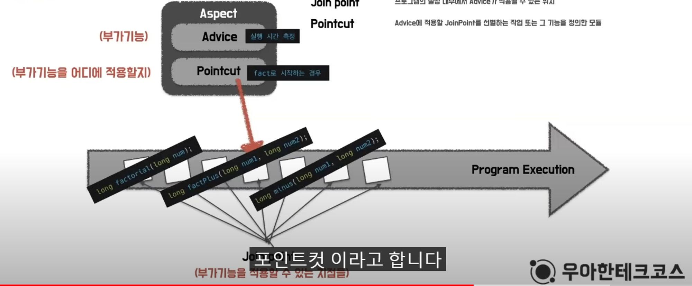
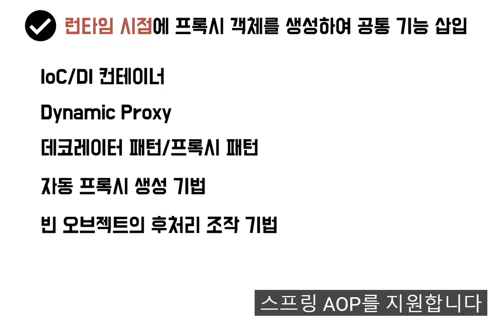

## [Java] OOP와 AOP의 차이점에 대해 설명해주세요

## OOP란?

- Object-Oriented Programming이란 객체지향적인 프로그래밍이다.
    - 객체지향이란 어떤 프로그래밍 방식, 방법론을 말한다.
    - 객체 지향 기법은 사용 기법이 아닌 설계 기법이다.
- OOP는 객체를 기준으로 코드를 나누어 구현한다.
    - 자바의 경우 클래스

## OOP의 특징

### 캡슐화

- 하나의 객체에 대해 그 객체가 특정한 목적을 위한 필요한 변수나 메서드를 하나로 묶는 것을 의미함.
    - 외부의 잘못된 접근으로 값이 변하는 것을 막기 위해 클래스 내의 변수나 함수를 감추거나 드러내는 은닉성을 가지고 있음.

### 추상화 (Abstraction)

- 중요하고 공통된 성질들을 추출하여 부모 클래스를 선정하는 개념이다.

### 상속

- 상위 클래스의 속성(변수)과 기능(메서드)을 재사용하여(상속) 하위 클래스가 전부 물려받는 것을 말한다.
    - 코드의 중복 제거, 코드 재사용성 증대 효과를 누릴 수 있다.
    - 자주 사용될 것이 예상되는 기능을 모아 클래스로 만들어 놓으면 편하게 재사용을 함으로써 유지보수 효울화를 추구할 수 있다.

### 다형성

- 부모 클래스에서 물려받은 함수를 자식 클래스 내에서 오버라이딩 되어 사용하는 것
- 같은 자료형에 여러가지 타입의 데이터를 대입하여 다양한 결과를 얻어낼 수 있는 성질
    - 자바에서 오버로딩, 오버라이딩, 업캐스팅, 다운캐스팅, 인터페잇, 추상메서드, 추상클래스 방법이 모두 다형석에 속한다.

---

## AOP란?

Aspect Oriented Programming 관점 지향 프로그래밍

AOP에서 말하는 Aspect는 관심사라고도 할 수 있다.

- 횡단 관심사(Cross-Cutting Concern)의 분리를 허용함으로써 모듈성을 증가시키는 것이 목적인 프로그래밍 패러다임
- 여러 객체에 공통으로 적용할 수 있는 기능을 분리해서 개발자는 반복 작업을 줄이고 핵심 기능 개발에만 집중할 수 있음 (스프링에만 존재하는 개념은 아님)

## 예시

팩토리얼 연산을 하는 계산기

```java
public interface Calculator {

    long factorial(long num);
}
```

BasicCalculator는 반복문으로 팩토리얼 연산 진행

```java
public class BasicCalculator implements Calculator{

    @Override
    public long factorial(final long num) {
        long result = 1;
        for (long i = 1; i <= num; i++) {
            result *= i;
        }

        return result;
    }
}
```

### 새로운 요구 사항

방금 구현한 팩토리얼 연산의 실행시간을 구하고 싶다

이를 위해서 팩토리얼 메서드 앞 뒤에 실행 시간을 측정하는 코드를 추가

```java
public class BasicCalculator implements Calculator{

    @Override
    public long factorial(final long num) {
        long start = System.currentTimeMillis(); // 추가
        try {
            long result = 1;
            for (long i = 1; i <= num; i++) {
                result *= i;
            }
            return result;
        } finally {
            long end = System.currentTimeMillis(); // 추가
            System.out.printf("Basic Calculator의 factorial(%d) 실행 시간 -> %d \n", num, (end - start));
        }
    }
}
```

### 새로운 요구 사항

반복문 말고 재귀로도 구현하고 싶다.

RecursiveCalculator 생성

```java
public class RecursiveCalculator implements Calculator {
    @Override
    public long factorial(final long num) {
        if (num == 0) {
            return 1;
        }
        return num * factorial(num - 1);
    }
}
```

이번에는 구현체들 내부에 실행시간 측정 로직을 추가한 것이 아니라

호출하는 코드에 실행시간 측정 코드를 추가

```java
public class Main {
    public static void main(String[] args) {
        Calculator basic = new BasicCalculator();
        Calculator recursive = new RecursiveCalculator();

        long basicStart = System.currentTimeMillis();
        basic.factorial(100);
        long basicEnd = System.currentTimeMillis();
        System.out.printf("Basic Calculator의 factorial(100) 실행 시간 -> %d \n", (basicEnd - basicStart));

        long recursiveStart = System.currentTimeMillis();
        recursive.factorial(100);
        long recursiveEnd = System.currentTimeMillis();
        System.out.printf("Recursive Calculator의 factorial(100) 실행 시간 -> %d \n", (recursiveEnd - recursiveStart));
    }
}
```

### 새로운 요구사항

밀리초 말고 나노초 단위로 시간을 측정

이 요구사항을 반영하기 위해서는 나타나는 `모든 코드에서 실행시간 측정 코드를 수정`해야 된다.

```java
public class Main {
    public static void main(String[] args) {
        Calculator basic = new BasicCalculator();
        Calculator recursive = new RecursiveCalculator();

        long basicStart = System.nanoTime(); // 수정
        basic.factorial(100);
        long basicEnd = System.nanoTime(); // 수정
        System.out.printf("Basic Calculator의 factorial(100) 실행 시간 -> %d \n", (basicEnd - basicStart));

        long recursiveStart = System.nanoTime(); // 수정
        recursive.factorial(100);
        long recursiveEnd = System.nanoTime(); // 수정
        System.out.printf("Recursive Calculator의 factorial(100) 실행 시간 -> %d \n", (recursiveEnd - recursiveStart));
    }
}
```

기존 코드의 수정이 필요, 코드 중복이 발생한다.

## 해결 방법 - 프록시 사용

### 프록시란?

자신이 클라이언트가 사용하려고 하는 실제 대상인 것처럼 위장해서 클라이언트의 요청을 받아주는 것 (대리인, 대리자)


실제 대상인 타깃인 것 처럼 위장해서 클라이언트 요청을 대신 받아준다.

- 클라이언트가 타깃에 접근하는 방법을 제어할 수 있다 → 프록시 패턴
- 타깃에 부가적인 기능을 부여할 수 있다. → 데코레이터 패턴

## 실행시간  측정하는 객체 구현

```java
public class ExecutionTimeCalculator implements Calculator{
    
    private Calculator delegate;

    public ExecutionTimeCalculator(final Calculator delegate) {
        this.delegate = delegate;
    }

    @Override
    public long factorial(final long num) {
        long start = System.nanoTime();
        long result = delegate.factorial(num);
        long end = System.nanoTime();
        System.out.printf("$s의 factorial(%d) 실행 시간 -> %d \n",
                delegate.getClass().getSimpleName(),
                num,
                (end - start));
        return result;
    }
}
```

- Basic과 마찬가지로 Calculator 인터페이스를 구현하고
- 내부에 인터페이스를 필드로 갖고
- 의존성 주입을 하고
- 핵심 연산을 실행했던 factorial() 메서드에서는 팩토리얼 연산이 아니라 부가기능인 실행시간을 측정해줍니다.
- 핵심연산인 실행시간 측정은 외부에서 주입받은 객체에게 위임합니다.

## 결과 및 실행 과정

```java
public class Main {
    public static void main(String[] args) {
        Calculator proxyCalculator1 = new ExecutionTimeCalculator(new BasicCalculator());
        System.out.println(proxyCalculator1.factorial(20));

        Calculator proxyCalculator2 = new ExecutionTimeCalculator(new RecursiveCalculator());
        System.out.println(proxyCalculator2.factorial(20));
    }
}
```


  



- 클라이언트가 f(20) 호출 → ExecutionTimeCal이 요청을 받고
- 실행 전 시간을 구한 후, 연산 기능을 BasicCal에게 위임하고
- 팩토리얼 결과값을 반환하고,
- ExecutionTimeCal는 다시 실행 후 시간을 구하고 실행 시간을 측정 후 출력한다.
- 그리고 팩토리얼 연산 값을 클라이언트에게 반환한다.

`기존 코드를 변경하지 않고 실행 시간을 출력할 수 있음`

`실행 시간을 구하는 코드의 중복 제거`

## 정리

각각의 객체는 핵심기능을 갖는다. (반복문, 재귀, …)

실행시간 측정이라는 부가 기능이 도입되면 코드의 중복이 발생한다.

만약 로깅이라는 새로운 부가 기능이 추가 된다면 코드의 중복이 또 발생하는데

`핵심 기능과 부가 기능의 관점을 분리하여 부가기능에서 바라보는 공통된 부분을 추출하는 것이 AOP의 개념이다.`



부가 기능은 가로 방향에서 공통된 부분을 추출했기 때문에 횡단 관심사라고 부른다.



`핵심 기능에 공통 기능을 삽입`

핵심 기능의 코드를 수정하지 않으면서, 공통 기능의 구현을 추가하는 것이 AOP의 기본 개념

## AOP 용어 정리

- Target Object
    - 부가 기능을 부여할 대상
- Aspect
    - AOP의 기본 모듈.
    - 그 자체로 애플리케이션의 핵심 기능을 담고있진 않지만, 애플리케이션을 구성하는 중요한 가지 요소.
    - `부가될 기능을 정의한 Advice와 그 Advice를 어디에 적용할지 결정하는 Pointcut을 함께 가짐`
        - 트랜잭션 관리가 가장 좋은 예시임. @Aspect를 사용해서 구현
- Advice
    - 타깃에게 제공할 `부가 기능을 담은 모듈.`
    - 타깃이 필요없는 순수한 부가 기능, `Aspect가 무엇을 언제 할지를 정의하고있음.`
        - Around, Before, After Throwing 등 다양한 어드바이스가 존재
- JoinPoint
    - 프로그램의 실행 내부에서 `Advice(부가 기능)가 적용될 수 있는 위치`
        - 스프링 AOP는 프록시 방식을 사용하므로 JoinPoint는 항상 메서드 실행 지점이다
- Pointcut
    - Advice에 적용할 `JoinPoint를 선별하는 작업` 또는 그 기능을 정의한 모듈
        - 스프링 AOP의 JoinPoint는 메서드의 실행이므로, 스프링의 Pointcut은 메서드를 선정하는 기능을 한다.



## AOP를 구현하는 방법

- 컴파일 시점에 코드에 공통 기능 삽입
- 클래스 로딩 시점에 바이트 코드에 공통 기능 삽입
    - 위 두 가지는 AOP 프레임워크인 AspectJ가 제공하는 컴파일러나 클래스 로더 조작기 같은 새로운 것을 사용해야 하므로 좀 더 유연한 AOP를 적용할 수 있지만, 부가적인 의존성을 추가해야 된다는 단점이 있다.
- 런타임 시점에 프록시 객체를 생성하여 공통 기능 삽입
    - 스프링에서는 이 방법을 사용한다.

### 런타임 시점에 프록시 객체를 생성하여 공통 기능 삽입

- 컴파일러나 클래스 로더 조작기를 설정하지 않아도 됨
- 프록시는 메서드 오버라이딩 개념으로 동작하기 때문에, `스프링 AOP는 메서드 실행 시점에만 AOP를 적용`할 수 있음
- 스프링 AOP는 `스프링 컨테이너가 관리할 수 있는 빈에만 AOP를 적용`할 수 있음
- AspectJ를 직접 사용하는 것이 아니라, AspectJ의 문법을 차용하고 프록시 방식의 AOP 적용



## 스프링에서 AOP 사용

스프링에서 AOP는 무조건 빈으로 등록해야 하므로 @Componet 를 사용하여 빈으로 등록한다.

```java
@Component
public class BasicCalculator implements Calculator {

    @Override
    public long factorial(final long num) {
        long result = 1;
        for (long i = 1; i <= num; i++) {
            result *= i;
        }

        return result;
    }
}
```

@Aspect 를 정의한다.

메서드 이름이 fact로 시작하는 경우라는 포인트컷을 정의해준다.

포인트컷을 정의한 메서드의 시그니처를 어드바이스를 정의할 때도 사용을 해준다.

- Around Advice (@Around)
    - 메서드 실행 전, 후 또는 exception 발생 시점
- Before Advice (@Before)
    - 메서드 호출 전
- After Returning Advice (@AfterReturning)
    - 메서드가 Exception 없이 실행 된 이후
- After Throwing Advice
    - 메서드를 실행하는 도중 Exception이 발생한 경우
- After Advice
    - Exception 발생 여부 상관 없이 메서드 실행 후

```java
@Component
@Aspect
public class ExecutionTimeAspect {

    @Pointcut("execution(* fact*(..))") // 메서드 이름이 fact~~ 로 시작
    private void publicTarget() {

    }

    @Around("publicTarget()") // Advice 정의
    public Object measure(ProceedingJoinPoint joinPoint) throws Throwable {
        long start = System.nanoTime(); // 전 후에 실행 시간 측정
        try {
            Object result = joinPoint.proceed(); // 타깃 호출
            return result;
        } finally {
            long finish = System.nanoTime(); // 전 후에 실행 시간 측정
            Signature signature = joinPoint.getSignature();
            System.out.printf("%s.%s(%s) 실행 시간: %d \n",
                    joinPoint.getTarget().getClass().getSimpleName(),
                    signature.getName(),
                    Arrays.toString(joinPoint.getArgs()),
                    (finish - start));
        }
    }
}
```

테스트 작성

```java
@SpringBootTest
class ExecutionTimeAspectTest {

    @Autowired
    private Calculator basicCalculator;

    @Test
    void test() {
        long factorialAnswer = basicCalculator.factorial(5);
        System.out.printf("factorial 결과: %d \n", factorialAnswer);

        long plusAnswer = basicCalculator.factPlus(2, 10);
        System.out.printf("plus 결과: %d \n", plusAnswer);

        long minusAnswer = basicCalculator.minus(2, 10);
        System.out.printf("minus 결과: %d \n", minusAnswer);
    }
}
/* 결과
BasicCalculator.factorial([5]) 실행 시간: 19100 
factorial 결과: 120 
BasicCalculator.factPlus([2, 10]) 실행 시간: 6700 
plus 결과: 12 
minus 결과: 8
/*
```

`Pointcut으로 정희해 놓은 fact로 시작하는 메서드인 경우에만 실행 시간 측정이라는 부가 기능이 적용된 것을 확인할 수 있다.`

출처: https://www.youtube.com/watch?v=hjDSKhyYK14