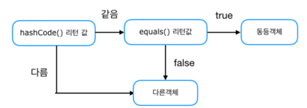

## [Java] equals를 overriding 할 때, hashCode도 재정의 해야하는 이유는?
### equals()
- boolean equals()는 기본적으로 2개의 객체가 동일한지 검사하기 위해 사용합니다.
- 두 객체가 가리키는 주소가 동일한 경우에만 동일한 객체가 됩니다.
- 필요성
  - 동일한 객체가 서로 다른 메모리에 존재한다면 두 객체는 동일한 객체가 아닙니다. 
  - 하지만 같은 값을 가지고 있으므로 같은 값으로 인식되어야 합니다. 
  - 이와 같은 특성을 동등성 이라고 합니다. 
  - equals는 이 동등성을 지키기 위해서 equals를 오버라이딩하여 다른 메모리의 같은 값을 가지는 객체를 같은 객체로 인식하게 해줍니다.

### hashCode()
- int hashCode()는 런타임 환경에서 객체가 가지는 유일한 Integer값을 반환합니다.
- Object 클래스에서는 기본적으로 객체의 메모리 주소를 반환합니다.

### equals()와 hashcode()의 관계
- equals가 같으면 hashCode도 동일해야합니다.
- hashCode가 같다고 equals도 동일한것은 아닙니다.(하지만 만약 동일 객체라면 동일 해야한다 )
- 하지만 효율성을 높이기 위해서는 동일객체가 아닌경우의 해시코드가 동일한 경우는 없는 것이 유용합니다.

### hash 코드를 재정의 해야 하는 이유는? 
- hash 코드를 재정의 하지 않는 경우 예상과 같이 코드가 동작하지 않는 경우가 발생할 수 있습니다.  
- Collection(HashSet, HashMap, HashTable)을 사용할 때 문제가 발생한다.  
   
- hashCode 메서드의 리턴값부터 확인 후 equals 메서드로 넘어가기 때문에 hashCode가 다르다면 equals가 true 이더라도 같은 객체가 아니게 됩니다.
- 따라서, 동일 객체가 두 번 저장 되는 경우가 생길 수 있습니다.   
- 따라서 equals를 재정의 하는 경우 hashcode도 재정의하는것이 필요합니다.
- 이를 통해 Collection의 안정성을 제공할 수 있습니다.

### equals를 재정의 하는 경우 고려해야 할 점은?
- 반사성, 대칭성, 추이성 + 일관성(항상 동일한 결과가 반환되어야 한다.)
- 반사성 x.equals(x) 는 참이여야 한다.
- 대칭성 x.equals(y) 가 참이면 y.equals(x)도 참이여야한다.
- 추이성 x.equals(y), y.equals(z),이면 x.equals(z)도 참이여야 한다.
- 일관성 동일 객체에 대해 equals를 비교하면 같은 값이 출력되어야 한다.

### 참고할 만한 자료, 참고 자료, 이미지 출처
[참고1](https://tecoble.techcourse.co.kr/post/2020-07-29-equals-and-hashCode)  
[참고2](https://mangkyu.tistory.com/101)  
[참고3](https://blog.yevgnenll.me/posts/jpa-entity-eqauls-and-hashcode-equality)  
[JPA관점의 equals, hashcode](https://velog.io/@park2348190/JPA-Entity의-equals와-hashCode)  
[자바의 해시맵 동작 방식 java7,8기준](https://d2.naver.com/helloworld/831311)   
[참고 자료4](https://lordofkangs.tistory.com/78)  
[참고 자료5](https://hongjw1938.tistory.com/16)  