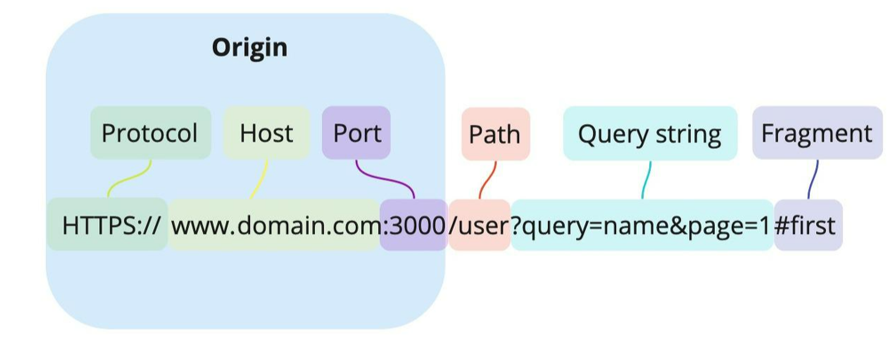
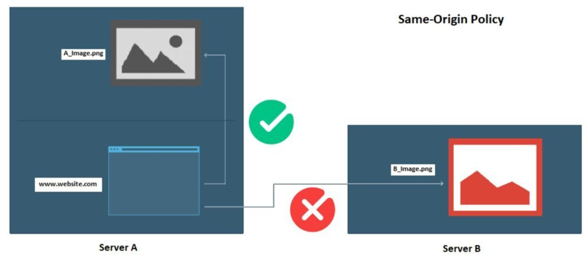
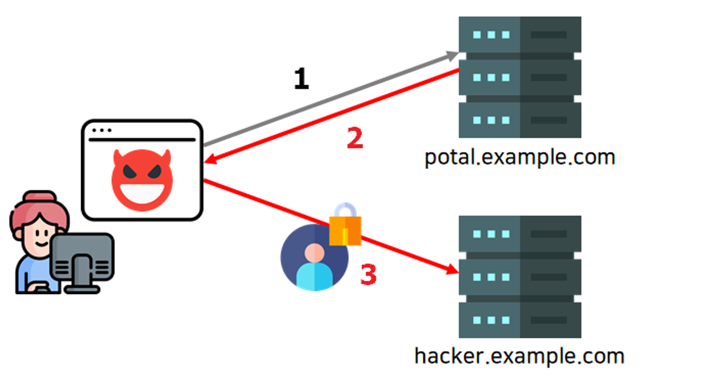
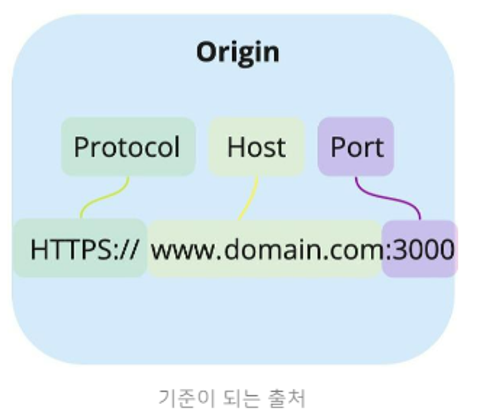
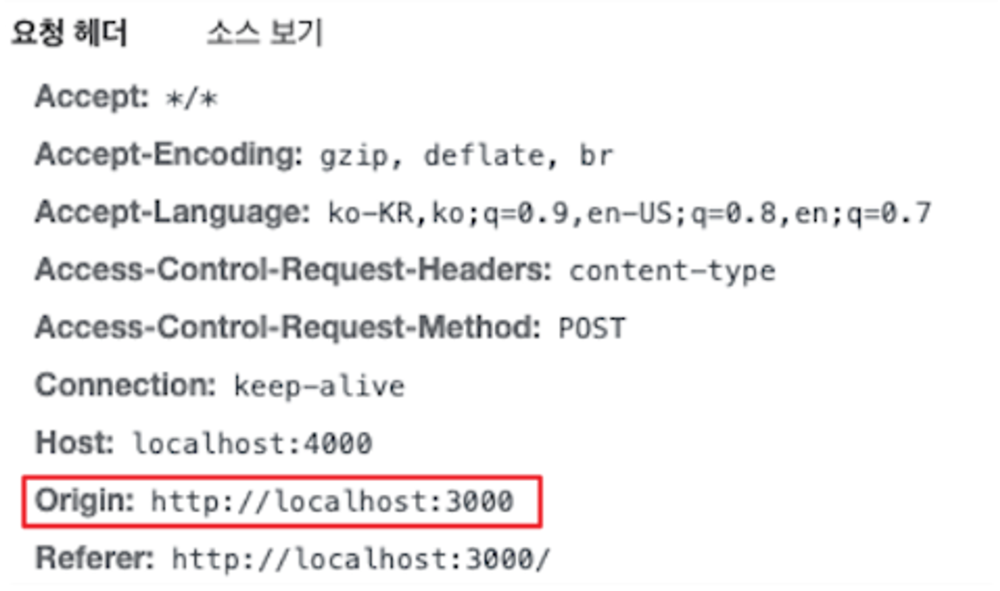
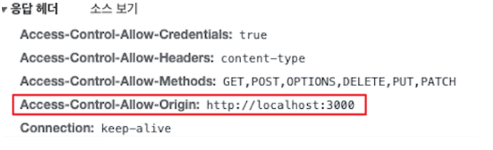
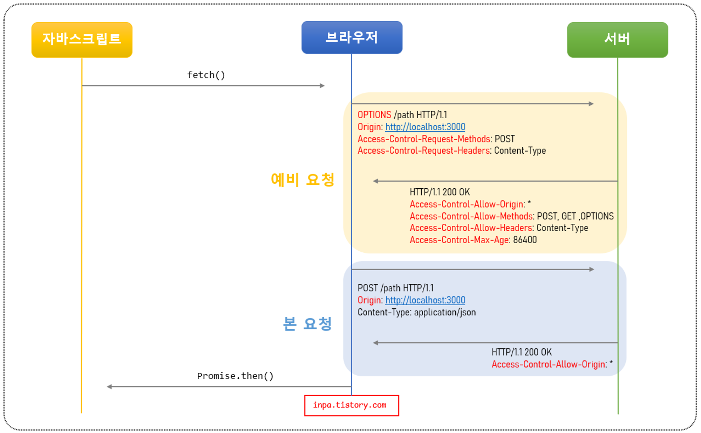
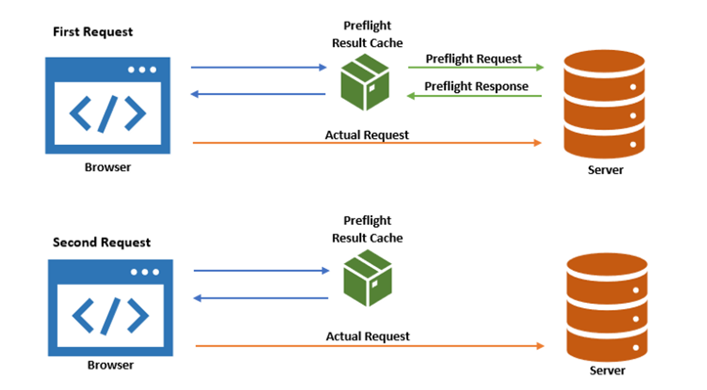

## CORS란?

- CORS는 함축 단어로써 이를 풀면 Cross-Origin Resource Sharing 이라는 단어로 이루어져있다.
- 직역하면 `교차 출처 리소스 공유 정책`이라고 해석할 수 있는데, 교차 출처라고 하는 것은(엇갈린)다른 출처를 의미하는 것으로 보면 된다.

## 출처(Origin)란?

- 우리가 어떤 사이트를 접속할 때 인터넷 주소창에 우리는 URL이라는 문자열을 통해 접근한다.
- 이처럼 URL은 [https://domain.com:3000/user?query=name&page=1](https://domain.com:3000/user?query=name&page=1과) 과 같이 하나의 문자열 같지만, 사실은 다음과 같이 여러개의 구성 요소로 이루어져 있다.

- Protocol(Scheme): http, https
- Host: 사이트 도메인
- Port: 포트 번호
- Path: 사이트 내부 경로
- Query string: 요청의 key와 value값
- Fragment: 해시태그

### CORS를 이해하는데 있어 딱 3가지만 기억하면 된다.

- Origin: Protocol + Host + Port
- 즉, `출처(Origin)`라는 것은 Protocol과 Host 그리고 Port까지 모두 합친 URL을 의미한다.

## 동일 출처 정책(Same-Origin Policy)

- 먼저 SOP(Same-Origin Policy) 정책은 단어 그대로 동일한 출처에 대한 정책을 말한다.
- 그리고 이 SOP 정책은 `동일한 출처에서만 리소스를 공유할 수 있다.`라는 법률을 가지고 있다.
- 즉, 동일 출처(Same-Origin) 서버에 있는 리소스는 자유로이 가져올 수 있지만,
  다른 출처(Cross-Origin) 서버에 있는 이미지나 유튜브 영상 같은 리소스는 상호작용이 불가능하다.

### 동일 출처 정책이 필요한 이유

동일 출처가 아닌 경우 접근을 차단하는 이유는 뭘까?

- 출처가 다른 두 애플리케이션이 자유로이 소통할 수 있는 환경은 꽤 위험한 환경이다.
- 제약이 없다면, 해커가 CSRF(Cross-Site Request Forgery)나 XSS(Cross-Site Scripting) 등의 방법을 이용해서 우리가 만든 애플리케이션에서 해커가 심어놓은 코드가 실행하여 개인 정보를 가로챌 수 있다.
- 다음은 SOP 정책이 없는 상황에서 악의적인 홈페이지에 접속하는 상황을 가정한 것이다.

1. 사용자가 악성 사이트에 접속한다.
2. 이 때 해커가 몰래 심어놓은 악의적인 자바스크립트가 실행되어, 사용자가 모르는 사이에 어느 포털 사이트에 요청을 보낸다.
3. 그럼 포털 사이트에서 해당 브라우저의 쿠키를 이용하여 로그인을 하거나 등 상호작용에 따른 개인 정보를 응답 값을 받은 뒤, 사이트에서 해커 서버(hacker.example.com)로 재차 보낸다.
4. 이외에도 사용자가 접속 중인 내부망의 아이피와 포트를 가져오거나, 해커가 사용자 브라우저를 프록시처럼 악용할 수 있다.

따라서 이러한 악의적인 경우를 방지하기 위해, SOP 정책으로 동일하지 않는 다른 출처의 스크립트가 실행되지 않도록 브라우저에서 사전에 방지하는 것이다.

### 같은 출처와 다른 출처 구분 기준

- SOP 정책의 중요도와 필요성에 대해 알았으니, 두 개의 출처의 다름 유무를 판단하는 기준이 무엇인지 알아보자.
- 출처(Origin)의 동일함은 두 URL의 구성 요소 중 `Protocol(Scheme), Host, Port 이 3가지만 동일`하다면 동일 출처로 판단한다.

다음은 https://www.domain.com:3000 출처에 대한 여러 URL에 따른 동일 출처 비교 표이다.

| URL | 동일 출처 ? | 이유 |
| --- | --- | --- |
| https://www.domain.com:3000/about | O | 프로토콜, 호스트, 포트 번호 동일 |
| https://www.domain.com:3000/about?username=inpa | O | 프로토콜, 호스트, 포트 번호 동일 |
| http://www.domain.com:3000 | X | 프로토콜 다름 (http ≠ https) |
| https://www.another.co.kr:3000 | X | 호스트 다름 |
| https://www.domain.com:8888 | X | 포트 번호 다름 |
| https://www.domain.com | X | 포트 번호 다름 (443 ≠ 3000) |

정리하자면 같은 프로토콜, 호스트, 포트를 사용한다면, 그 뒤의 다른 요소는 다르더라도 같은 출처로 인정된다.

반대로 프로토콜, 호스트, 포트 중 하나라도 자신의 출처와 다를 경우 브라우저는 정책상 차단한다.

## 교차 출처 리소스 공유(Cross-Origin Resource Sharing)

- 이처럼 교차 출처 리소스 공유(Cross-Origin Resource Sharing, CORS)는 단어 그대로 `다른 출처의 리소스 공유에 대한 허용/비허용 정책`이다.
- 보안이 중요하지만, 개발을 하다 보면 기능상 어쩔 수 없이 다른 출처 간의 상호작용을 해야 하는 케이스도 있다.
- 또한 실무적으로 다른 회사의 서버 API를 이용해야 하는 상황도 존재한다.
- 따라서 이와 같은 예외 사항을 두기 위해 CORS 정책을 허용하는 리소스에 한해 다른 출처라도 받아들인다는 것이다.

### 우리가 욕했던 CORS는 사실 해결책이었다.

- 우리를 괴롭히던 에러 메세지는 사실 브라우저의 SOP 정책에 따라 다른 출처츼 리소스를 차단하면서 발생된 에러이며, CORS는 다른 출처의 리소스를 얻기 위한 해결 방안 이었던 것이다.
- 요약하자면 `SOP 정책을 위반해도 CORS 정책에 따르면 다른 출처의 리소스라도 허용`한다는 뜻이다.

### 브라우저의 CORS 기본 동작 살펴보기

- 클라이언트에서 HTTP요청의 헤더에 Origin을 담아 전달
    - 기본적으로 웹은 HTTP 프로토콜을 이용하여 서버에 요청을 보내게 되는데,
    - 이 때 브라우저는 요청 헤더에 Origin이라는 필드에 출처를 함께 담아 보내게 된다.

- 서버는 응답헤더에 Access-Control-Allow-Origin을 담아 클라이언트로 전달한다.
    - 이후 서버가 이 요청에 대한 응답을 할 때 응답 헤더에 ‘Access-Control-Allow-Origin이라는 필드를 추가하고 값으로 `이 리소스를 접근하는 것이 허용된 출처 url`을 내려보낸다.

- 클라이언트에서 Origin과 서버가 보내준 Access-Control-Allow-Origin을 비교한다.
    - 이후 응답을 받은 브라우저는 자신이 보냈던 요청의 Origin과 서버가 보내준 응답의 Access-Control-Allow-Origin을 비교해본 후 차단할지 말지를 결정한다.
    - 만약 유효하지 않다면 그 응답을 사용하지 않고 버린다. (CORS 에러!!)
    - 위의 경우에는 둘 다 http://localhost:3000이기 때문에 유효하니 다른 출처의 리소스를 문제없이 가져오게 된다.

### 결국 CORS 해결책은 서버의 허용이 필요

- 위의 브라우저의 CORS 동작 과정을 살펴보니, 길고 길었던 여정의 결론은 `서버에서 Access-Control-Allow-Origin 헤더에 허용할 출처를 기재해서 클라이언트에 응답`하면 되는 것이었다.
  즉, 백엔드 개발자가 고쳐야 될 부분인 것이다.

## CORS 작동 방식 3가지 시나리오

## 예비 요청(Preflight Request)

- 브라우저는 요청을 보낼 때 한번에 바로 보내지 않고, 먼저 예비 요청을 보내 서버와 잘 통신 되는지 확인한 후 본 요청을 보낸다.
- 즉, 예비 요청의 역할은 본 요청을 보내기 전에 브라우저 스스로 안전한 요청인지 미리 확인하는 것이다.
- 이 때 브라우저가 예비 요청을 보내는 것을 Preflight라고 부르며, 이 예삐 요청의 HTTP 메서드를 GET이나 POST가 아닌 `OPTIONS`라는 요청이 사용된다는 것이 특징이다.
- 예를 들어 자바스크립트로 다음 API 요청을 보낸다고 가정해보자.

- 위의 사진상에는 요청 헤더의 Origin과 응답 헤더의 Access-Control-Allow-Origin의 URL값이 서로 같아 다른 출처라도 CORS(다른 출처 리소스 공유)가 허용된다. 따라서 정상 응답을 받는다.
- 만약, 둘이 다르게 되면 브라우저는 이 요청이 CORS 정책을 위반했다고 판단하고 에러를 뱉는다.

### 예비 요청의 문제점과 캐싱

- 요청을 보내기 전에 OPTIONS 메서드로 예비 요청을 보내 보안을 강화하는 목적의 취지는 좋다.
- 그러나 결국 실제 요청에 걸리는 시간이 늘어나게 되어 애플리케이션 성능에 영향을 미치는 크나큰 단점이 있다.
- 특히 수행하는 API 호출 수가 많으면 많을 수록 예비 요청으로 인해 서버 요청을 배로 보내게 되니 비용 적인 측면에서 폐가 될 수 있다.
- 따라서 `브라우저 캐시`를 이용해 Access-Control-Max-Age 헤더에 캐시될 시간을 명시해주면, 이 Prefligt 요청을 캐싱 시켜 최적화를 시켜줄 수 있다.

예비 요청 캐싱 기간에 대해서는, 파이어폭스 - 86400초(24시간), 크롬 - 7200초(2시간)이 최대다.

예비 요청 캐시는 다른 캐싱 메커니즘과 유사하게 작동한다.

1. 브라우저는 예비(Preflight) 요청을 할 때 마다, 먼저 Prefligt 캐시를 확인하여 해당 요청에 대한 응답이 있는지 확인한다.
2. 만일 응답이 캐싱 되어 있지 않다면, 서버에 예비 요청을 보내 인증 절차를 밟는다.
3. 만일 서버로 부터 Access-Control-Max-Age 응답 헤더를 받는다면 그 기간 동안 브라우저 캐시에 결과를 저장한다.
4. 다시 요청을 보내고 만일 응답이 캐싱 되어 있다면, 예비 요청을 서버로 보내지 않고 캐싱된 응답을 사용한다.

## 단순 요청(Simple Request)

- 단순 요청은 말그대로 `예비 요청(Prefligt)를 생략하고 바로 서버에 직행으로 본 요청`을 보낸 후, 서버가 이에 대한 응답의 헤더에 Access-Control-Allow-Origin 헤더를 보내주면 브라우저가 CORS 정책 위반 여부를 검사하는 방식이다.
- `3가지 경우를 만족`할 때만 가능하다.
    - 요청의 메서드는 GET, HEAD, POST 중 하나여야 한다.
    - Accept, Accept-Language, Content-Language, Content-Type, DPR, Downlink, Save-Data, Viewport-Width, Width 헤더일 경우에만 적용된다.
    - Content-Type 헤더가 application/x-www-form-urlencoded, multipart/form-data, text/plain 중 하나여야한다. 아닐 경우 예비 요청으로 동작된다.
- 이처럼 다소 `까다로운 조건`들이 많기 때문에, 위 조건을 모두 만족되어 단순 요청이 일어나는 상황은 드물다.
- 왜냐하면 대부분 HTTP API 요청은 text/xml 이나 application/json 으로 통신하기 때문에 3번째 Content-Type이 위반되기 때문이다.
- `따라서 대부분의 API 요청은 그냥 예비 요청(Prefligt)으로 이루어진다 라고 이해하면 된다.`

## 인증된 요청(Credentialed Request)

- 인증된 요청은 클라이언트에서 서버에게 `자격 인증 정보(Credential)`를 실어 요청할 때 사용되는 요청이다.
- 여기서 말하는 자격 인증 정보란 세션 ID가 저장되어있는 `쿠키(Cookie) 혹은 Authorization 헤더`에 설정하는 `토큰`값 등을 일컫는다.
- 즉, 클라이언트에서 일반적인 JSON 데이터 외에도 쿠키 같은 인증 정보를 포함해서 다른 출처의 서버로 전달할 때 CORS의 세 가지 요청 중 하나인 인증된 요청으로 동작된다는 말이며, 이는 기존의 단순 요청이나 예비요청과는 살짝 다른 인증 형태로 통신하게 된다.