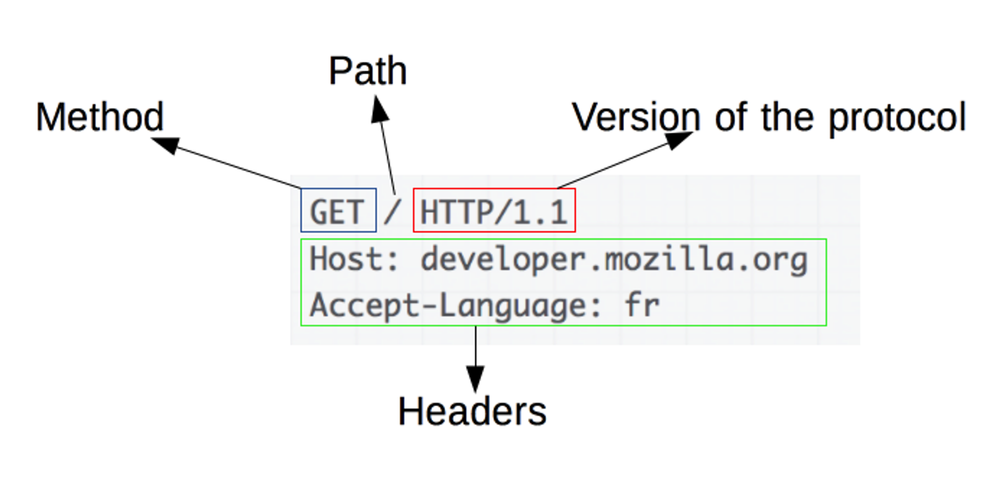

# HTTP에 대해 설명해주세요.

https://mangkyu.tistory.com/98

[https://github.com/gyoogle/tech-interview-for-developer/blob/master/Computer Science/Network/HTTP %26 HTTPS.md](https://github.com/gyoogle/tech-interview-for-developer/blob/master/Computer%20Science/Network/HTTP%20%26%20HTTPS.md)

## HTTP(Hyper Text Transfer Protocol)란?

- HTTP란 서버/클라이언트 모델을 따라 데이터를 주고 받기 위한 프로토콜이다.
- 즉, HTTP는 인터넷에서 하이퍼텍스트를 교환하기 위한 통신 규약으로, 80번 포트틀 사용하고 있다.
- 따라서 HTTP 서버가 80번 포트에서 요청을 기다리고 있으며, 클라이언트는 80번 포트로 요청을 보내게 된다.

### HTTP의 구조

- HTTP는 애플리케이션 레벨의 프로토콜로 TCP/IP 위에서 작동한다. HTTP는 상태를 가지고 있지 않는 Stateless 프로토콜이며 Method, Path, Version, Headers, Body 등으로 구성된다.

- 하지만 HTTP는 암호화가 되지 않은 평문 데이터를 전송하는 포로토콜이였기 때문에, HTTP로 비밀번호나 주민등록번호 등을 주고 받으면 제 3자가 정보를 조회할 수 있었다.
    - HTTP의 보안 취약점: 도청이 가능, 위장이 가능, 변조가 가능
    - 이러한 문제를 해결하기 위해 HTTPS가 등장하게 되었다.

## HTTPS(Hyper Text Transfer Protocol Secure)란?

- HTTPS는 HTTP에 데이터 암호화가 추가된 프로토콜이다.
- 인터넷 상에서 정보를 암호화하는 SSL 프로토콜을 사용해 클라이언트와 서버가 자원을 주고 받을 때 쓰는 통신 규약 HTTPS는 텍스트를 암호화 한다. (공개키 암호화 방식)
- HTTPS는 443번 포트를 사용하며, 네트워크 상에서 중간에 제 3자가 정보를 볼 수 없도록 암호화를 지원하고 있다.

### HTTPS 통신 흐름

1. 애플레케이션 서버(A)를 만드는 기업은 HTTPS를 적용하기 위해 공개키와 개인키를 만든다.
2. 신뢰할 수 있는 CA 기업을 선택하고, 그 기업에게 내 공개키 관리를 부탁하며 계약을 한다.
    1. CA란?: Certificate Authority로, 공개키를 저장해주는 신뢰성이 검증된 민간기업
3. 계약 완료된 CA 기업은 해당 기업의 이름, A서버 공개키, 공개키 암호화 방법을 담은 인증서를 만들고, 해당 인증서를 CA 기업의 개인키로 암호화해서 A서버에게 제공한다.
4. A서버는 암호화된 인증서를 갖게 되었따. 이제 A서버는 A서버의 공개키로 암호화된 HTTPS 요청이 아닌 요청이 오면, 이 암호화된 인증서를 클라이언트에게 건내준다.
5. 클라이언트가 main.html 파일을 달라고 A서버에 요청했다고 가정하자. HTTPS 요청이 아니기 때문에 CA기업이 A서버의 정보를 CA 기업의 개인키로 암호화한 인증서를 받게 된다.
    1. CA 기업의 공개키는 브라우저가 이미 알고있다.
6. 브라우저는 해독한 뒤 A서버의 공개키를 얻게 되었다.
7. 클라이언트가 A서버와 handshake 과정에서 주고받은 난수를 조합하여 pre-master-secret-key를 생성한 뒤, A서버의 공개키로 해당 대칭키를 암호화하여 서버로 보낸다.
8. A서버는 암호화된 대칭키를 자신의 개인키로 복호화 하여 클라이언트와 동일한 대칭키를 획득한다.
9. 클라이언트, 서버는 각각 pre-master-secret-key를 master-secret-key로 만든다.
10. master-secret-key를 통해 session-key를 생성하고 이를 이용하여 대칭키 방식으로 통신한다.
11. 각 통신이 종료될 때 마다 session-key를 파기한다.

HTTPS도 무조건 안전한 것은 아니다. (신뢰받는 CA 기업이 아닌 자체 인증서 발급한 경우 등)

이때는 HTTPS지만 브라우저에서 `주의 요함`, `안전하지 않은 사이트`와 같은 알림으로 주의 받게 된다.

클라이언트와 서버는 탐색과정을 거친다 - handshake

클라이언트가 서버로 무작위 데이터를 보낸다.

서버도 마찬가지로 답변으로 무작위 데이터와 해당 서버의 인증서를 실어보낸다. (핸드쉐이크)

인증서가 진짜인지 브라우저에 내장된 CA들의 정보를 통해 확인하다. (비대칭키 사용)

CA의 인증을 받은 인증서들은 해당 CA의 개인키로 암호화가 되어있다.

이게 진짜라면 브라우저에 저장된 CA의 공개키로 복호화 할 수 있다.

이 공개키로 복호화될 수 있는 인증서를 발급할 수 있는건 그에 대응하는 개인키를 가진 CA뿐이니까.

복호화된 인증서에서는 서버에 공개키가 포함되어있다.

!!

지금부터 주고 받는 데이터는 대칭키 방식과 비대칭키 방식을 혼합해서 사용한다.

비대칭키 방식으로 메세지를 암호화 및 복호화 하는건 대칭키로 할 때보다 컴퓨터에 훨씬 큰 부담을 준다. 사이트를 이용할 때 주고받을 그 다량의 데이터를 비대칭키로 일일이 암호화, 복호화 하는 것은 무리다.

따라서 대칭키로 암호화를 하는데, 대칭키는 탈취 위험이 있지 않았어?

→ 그 대칭키를 공유할 때 비대칭키를 사용하는 것이다.

아까 악수할 때 생성된 무작위 데이터가 있잖아?

클라이언트는 이 둘을 혼합해서 어떤 임시키를 만들어 이 임시 키는 서버의 공개키로 암호화 돼서 서버로 보내진 다음 양쪽에서 일련의 과정을 거쳐 동일한 대칭키가 만들어지는 것이다.

따라서 이 대칭키는 서버와 클라이언트 둘만 갖고 있은까 제 3자가 알아볼 걱정이 없다.