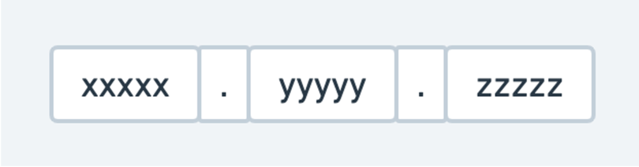

## JWT란?
>JWT는 Json Web Token의 약자로, JWT(Json Web Token)은 인터넷 표준 인증 방식이며 JSON으로 표현된 사용자 정보를 안전하게 주고받는데 사용되는 Token의 일종입니다. 
>
>JWT 내부에 서비스를 사용하기 위한 인증 정보가 담기며, JWT를 받은 서비스는 JWT가 위변조가 되었는지 알아차릴 수 있기 때문에 Token 기반의 인증 시스템에서 많이 활용됩니다. 
>
>기본적으로 JWT는 세 부분으로 나뉘어 져서 만들어 집니다.

## JWT 구조


JWT는 각각의 구성요소가 점(.)으로 구분이 되어 있습니다.
- Header
- Payload
- Signature

### Header

JWT에서 사용할 타입과 해시 알고리즘의 종류가 담겨있습니다.

```json
{
  "typ": "JWT",
  "alg": "HS512"
}
```

### Payload

서버에서 첨부한 사용자 권한 정보와 데이터인 클레임이 담겨있습니다. 클레임은 Key Value 형태로 된 값을 가지며 저장되는 정보에 따라 Registered, Public, Private로 구분됩니다.

**등록된 클레임(Registered Claims)**

- iss: 토큰 발급자(issuer)
- sub: 토큰 제목(subject)
- aud: 토큰 대상자(audience)
- exp: 토큰 만료 시간(expiration)
- nbf: 토큰 활성 날짜(not before), 이 날이 지나기 전의 토큰은 활성화되지 않는다.
- iat: 토큰 발급 시간(issued at)
- jti: JWT 토큰 식별자(JWT ID), 중복 방지를 위해 사용하며, 일회용 토큰(Access Token) 등에 사용한다.

    ```json
    {
      "sub": "subject",
      "iss": "abc",
    }
    ```


**공개 클레임(Public Claims)**

- 공개 클레임들은 충돌이 방지된 이름을 가지고 있어야한다. 주로 URI 형식으로 짓는다.

    ```json
    {
      "https://velog.io/jwt/public": true
    }
    ```


**비공개 클레임(Private Cliams)**

- 클라이언트와 서버 협의하에 사용되는 클레임이다. 공개 클레임과는 달리 이름이 중복되어 충돌될 수 있기 때문에 유의해야 한다.

    ```json
    {
      "username": "kim"
    }
    ```


### Signature

Header,Payload가 변조되었는지 확인하기 위한 전자서명 정보가 담겨 있습니다. JWT를 신뢰할 수 있는 토큰으로 인식하는 근거가 됩니다.

## JWT 특징
### 장점
- Header와 Payload를 가지고 Signature를 생성하므로 데이터 위변조를 막을 수 있습니다.
- 인증 정보에 대한 별도의 저장소가 ‘필수적으로’ 필요하지 않습니다.
- JWT는 토큰에 대한 기본 정보와 전달한 정보 및 토큰이 검증되었음을 증명하는 서명 등 필요한 정보를 자체적으로 지니고 있습니다.
- 클라이언트 인증 정보를 저장하는 세션과 다르게, 서버는 무상태(stateless)가 되어 서버 확장성이 우수해질 수 있습니다.
- 토큰 기반으로 다른 로그인 시스템에 접근 및 권한 공유가 가능합니다.
- 모바일 어플리케이션 환경에서도 잘 동작합니다. (모바일은 세션 사용 불가능)
- stateful 해야 하는 세션의 단점을 보완하기 위해 만들어진 JWT는 별도의 세션 저장소를 강제하지 않기 때문에 stateless 하여 확장성이 뛰어나고, signature를 통한 보안성까지 갖추고 있습니다.

### 단점
- Self-contained: 토큰 자체에 정보를 담고 있으므로 양날의 검이 될 수 있습니다.
- 토큰 길이: 토큰의 Payload에 여러 종류의 클레임을 저장하기 때문에, 정보가 많아질수록 토큰의 길이가 늘어나 네트워크에 부하를 줄 수 있습니다.
- Payload 인코딩: payload 자체는 암호화 된 것이 아니라 BASE64로 인코딩 된 것이기 때문에, 중간에 payload를 탈취하여 디코딩하면 데이터를 볼 수 있으므로, payload에 중요 데이터를 넣지 않아야 합니다.
- Store Token: stateless 특징을 가지기 때문에, 토큰은 클라이언트 측에서 관리하고 저장한다. 때문에 토큰 자체를 탈취당하면 대처하기가 어렵게 됩니다.
