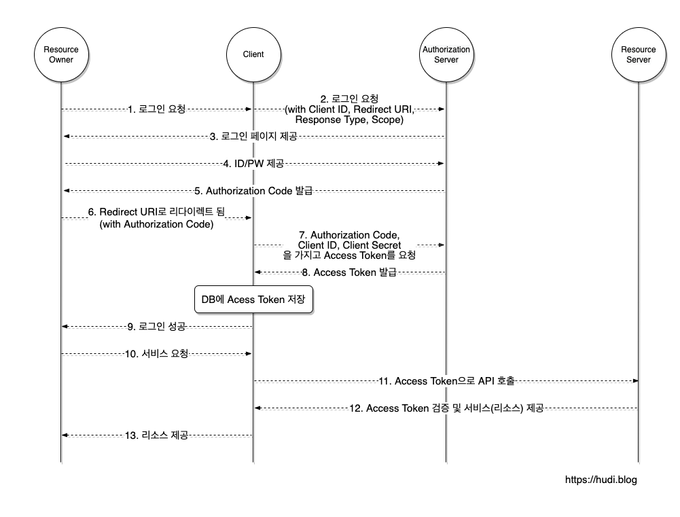

### OAuth

- 다양한 플랫폼의 유저 정보를 접근하기 위해, 3자 클라이언트(서비스)가 사용자의 접근 권한을 위임(Delegated Authorization) 받을 수 있는 프로토콜
- ex)
    - 유저 A의 페이스 북 친구 목록에 접근하기 위해, OAuth를 통해 유저 A의 친구 목록에 접근

### 주체

Resource Owner

- 리소스 소유자로, 구글, 페이스북 등 정보를 소유하고 있는 플랫폼

Authorization & Resource Server

- Authorization : Resource Owner를 인증하고, Client에게 접근 가능한 토큰을 발급해주는 인증 서버
- Resource Server : 리소스를 요청하는 서버

Client

- Resource를 이용하고자 하는 서비스

OAuth 2.0 동작 과정

출처 : https://hudi.blog/oauth-2.0/