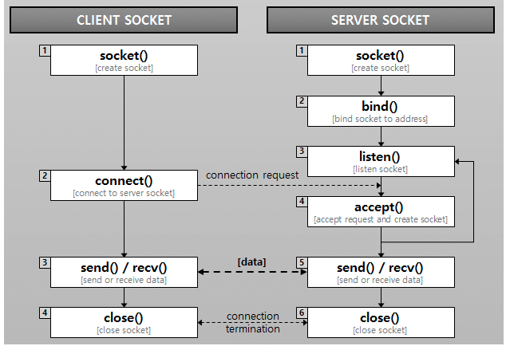

### Socket

- TCP/IP 기반 네트워크 통신에서 데이터 송수신의 마지막 접점
- 네트워크 상 통신을 위해 어떤 방법(프로토콜)으로, 어느 위치(IP)의, 무엇(Port, 프로그램)과 통신할 것인지 정의하여 이루어지는 통신
- 양방향 통신
- 지속적인 연결 및 실시간 데이터 전송의 장점

출처 : https://helloworld-88.tistory.com/215

출처 : https://kadosholy.tistory.com/125