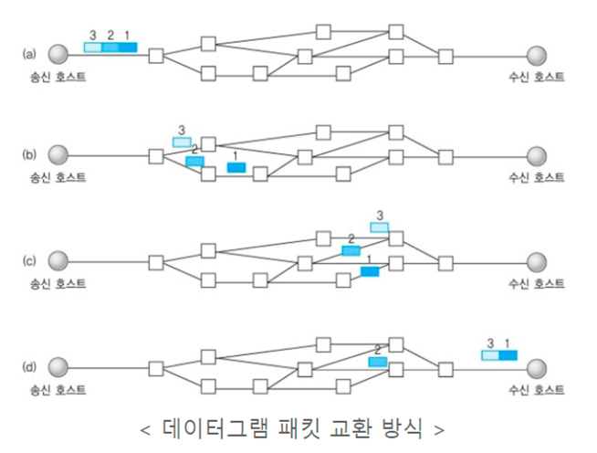
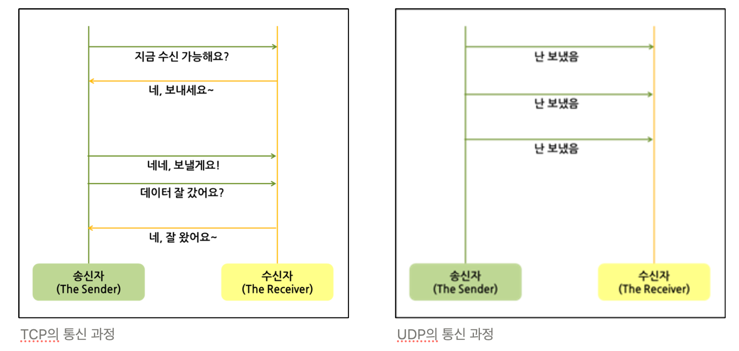
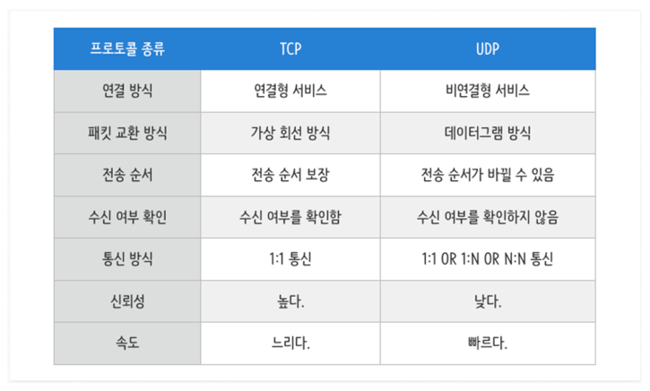

# TCP와 UDP의 특징과 차이점을 설명해주세요.

---

>### < 요약 >
>TCP와 UDP는 OSI 7 계층들 중 TCP/IP의 전송 계층에서 사용되는 프로토콜입니다.
> 
>TCP는 연속성보다 신뢰성 있는 전송이 중요할 때 사용되는 프로토콜로 안정적이고 순서를 보장하는 데이터 통신이 가능하여 주로 파일 전송에 사용됩니다..
>
>UDP는 TCP보다 빠르고 네트워크 부하가 적다는 장점이 있지만, 신뢰성 있는 데이터 전송을 보장하지는 않기 때문에 신뢰성보다는 연속성이 중요한 실시간 스트리밍과 같은 서비스에 자주 사용됩니다.

## TCP(Transmission Control Protocol)

TCP는 *연결 지향적 프로토콜이며 장치들 사이에 논리적인 접속을 성립하기 위해 연결을 설정해 신뢰성을 보장하는 연결형 서비스입니다. TCP를 사용하면 안정적으로, 순서대로, 에러 없이 데이터를 교환할 수 있습니다.

(연결 지향적 프로토콜은 클라이언트와 서버가 연결된 상태에서 데이터를 주고 받는 프로토콜을 의미합니다)

### TCP의 특징

1. 연결형 서비스로 가상 회선 방식 제공
    - 3-way-handshaking 과정을 통해 연결을 설정합니다.
    - 4-way-handshaking 과정을 통해 연결을 해제합니다.
2. 흐름 제어(Flow Control)
    - 데이터 처리 속도를 조절하여 수신자의 버퍼 오버플로우를 방지합니다.
3. 혼잡 제어(Congestion Control)
    - 네트워크 내의 패킷 수가 과도하게 증가하지 않도록 방지합니다.
4. 높은 신뢰성 보장
    - 신뢰성이 높은 전송을 제공하기 때문에 파일 전송과 같은 경우에 유리합니다.
    - 하지만 신뢰성을 보장하기 위해서 속도가 느려져 UDP보다 느립니다.
5. 전이중,  점대점 방식 제공
    - 전이중(Full-Duplex) : 전송이 양방향으로 동시에 일어날 수 있습니다.
    - 점대점(Point to Point) : 각 연결이 정확히 2개의 종단점을 가지고 있습니다.

## UDP(User Datagram Protocol)

UDP는 *비연결형 프로토콜이며 장치들 사이에 연결을 위한 논리적인 경로 없이 각각의 패킷이 다른 경로로 전송되며 독립적인 관계를 가집니다.

### UDP의 특징

1. 비연결형 서비스로 데이터그램 방식 제공
    - 연결을 설정하고 해제하는 과정이 존재하지 않습니다.
    - 데이터의 전송 순서가 보장되지 않습니다.
2. 데이터 수신 여부 확인 기능 없음
    - TCP의 3-way-handshaking과 같은 과정이 존재하지 않습니다.
3. 낮은 신뢰성
    - 흐름 제어나 혼잡 제어가 없기 때문에 제대로 된 전송을 확인할 수 없습니다.
4. TCP보다 빠른 속도
    - 신뢰성을 보장하기 위한 과정이 없기 때문에 TCP보다 속도면에서 우수합니다.
    - 네트워크 부하가 적습니다.
    - 실시간 서비스에 자주 사용됩니다.
5. 1:1 & 1:N & N:N 통신이 가능합니다.

## TCP vs UDP

---

>#### 참고 자료 :
>https://dev-coco.tistory.com/144
>
>https://mangkyu.tistory.com/15
>
>https://velog.io/@hidaehyunlee/TCP-%EC%99%80-UDP-%EC%9D%98-%EC%B0%A8%EC%9D%B4
>
>https://seongonion.tistory.com/74
