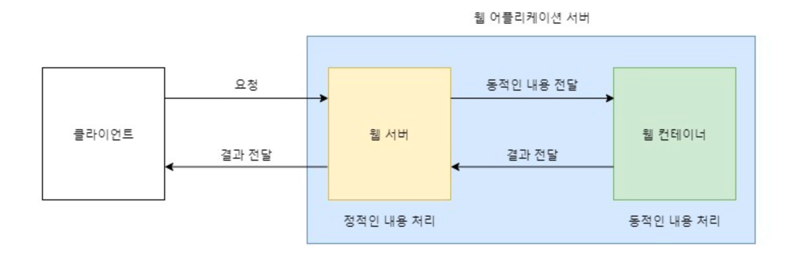

# Web Server와 WAS의 차이점을 설명해주세요. 

## 웹 서버(WS, Web Server)
- 정적인 웹 페이지나 파일을 제공하는데 주로 사용된다.
- 클라이언트의 요청에 웹 서버가 요청의 응답으로 정적 콘텐츠(HTML, CSS, JavaScript 파일 등)을 반환한다.
- Apache Server, Nginx, IIS가 있다.

## 웹 어플리케이션 (WAS, Web Application Server)

- DB 조회 및 다양한 로직 처리 요구시 동적인 컨텐츠를 제공하기 위해 만들어진 애플리케이션 서버
- 동적인 콘텐츠를 제공하는데 사용된다.
- 클라이언트의 요청에 대해서 서버와 **데이터 베이스의 상호작용으로 동적 컨테츠를 생성해서 반환하는 형태이**다. 해당 요청을 처리하기 위해 서블릿 컨테이너나 ,jsp 컨테이너, ejb컨테이너가 포함될 수 있다.
- Apache Tomcat, JBoss, Jeus, WebSphere가 있다.

----

**대부분의 WAS는 정적인 컨텐츠를 제공해주고 있기 때문에, 웹 서버 없이 WAS만 존재할 수 있다.**
**그래서 WAS는 웹 서버를 포함하는 개념이라고 생각해도 될 것 같다.-[[👻](https://victorydntmd.tistory.com/121)]**

----

### 하지만 왜 WAS만 사용하지 않는가.
WAS는 DB 조회 및 다양한 로직 처리에 집중해야 한다. 
단순환 정적 컨텐츠는 웹 서버에게 맡기며 기능을 분리시켜 서버 부하를 방지할 수 있다. 만약 WAS가 정적 컨텐츠 요청까지 처리하면 부하가 커지고 동적 컨텐츠 처리가 지연되면서 수행 속도가 느려지고 이로 인해 페이지 노출 시간이 늘어나는 문제가 발생하여 효율성이 크게 떨어진다. 따라서 웹 서버를 WAS 앞에 두고 필요한 WAS들을 Web Server에 플러그인 형태로 설정하여 더욱 효율적인 분산처리가 가능해진다.

### Tomcat이 Apache Tomcat인 이유
2008년에 릴리즈 된 Tomcat 5.5 버전부터 정적 컨텐츠를 처리하는 기능이 추가되었는데, 이 기능이 순수 Apache를 사용하는 것에 비해 성능적 차이가 전혀 없으며 Tomcat이 Apache의 기능을 포함하고 있기 때문에 Apache Tomcat이라고 부른다.

### 참고/출처
[웹 서버와 WAS( Web Application Server ) 차이](https://victorydntmd.tistory.com/121)  
[Apache와 Tomcat 혹은 웹 서버와 WAS는 어떻게 다를까?](https://makemethink.tistory.com/169)  
[[Web] 웹 서버와 WAS의 차이를 쉽게 알아보자](https://codechasseur.tistory.com/25)