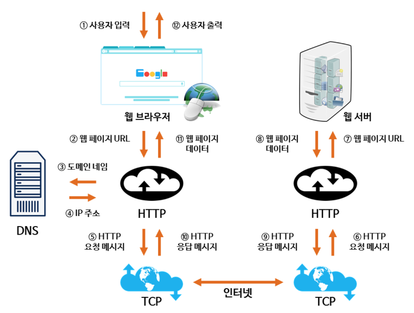

1. DNS 서버를 통해 `[www.naver.com](http://www.naver.com)` 에 대한 IP 주소를 요청한다.
2. DNS 서버로부터 전달 받은 IP 주소에 HTTP 요청을 보낸다.
3. 서버에서는 전송받은 HTTP 요청에 응답을 전송한다.
4. 클라이언트는 전송받은 응답을 통해 HTML 파일을 구성하여, 최종 출력한다.

출처 : [https://github.com/WooVictory/Ready-For-Tech-Interview/blob/master/Network/주소창에 naver.com을 치면 일어나는 일.md](https://github.com/WooVictory/Ready-For-Tech-Interview/blob/master/Network/%EC%A3%BC%EC%86%8C%EC%B0%BD%EC%97%90%20naver.com%EC%9D%84%20%EC%B9%98%EB%A9%B4%20%EC%9D%BC%EC%96%B4%EB%82%98%EB%8A%94%20%EC%9D%BC.md)