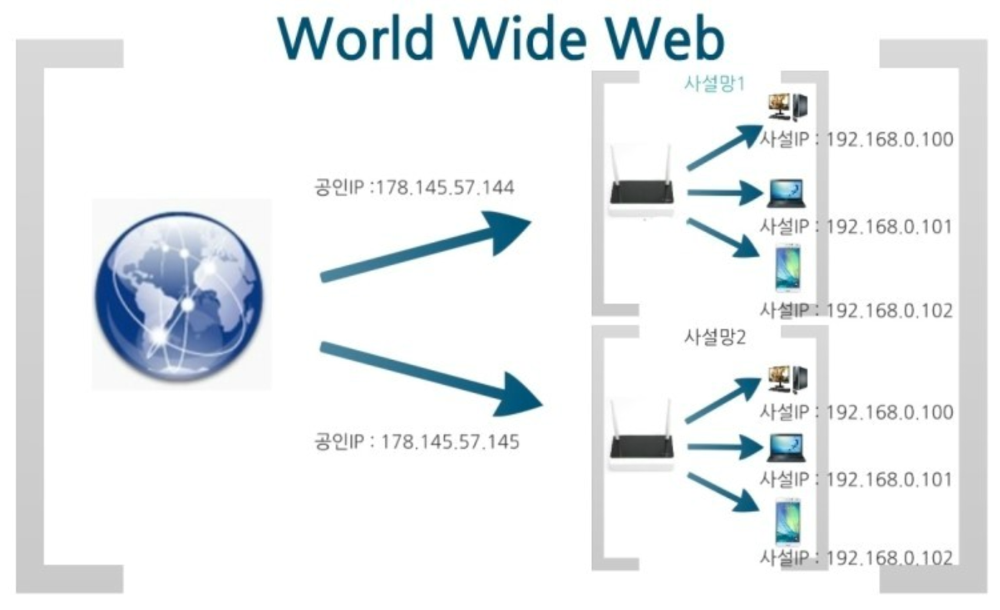

## 공인IP (Public IP)

공인 아이피는 공용 IP 주소라고도 불리며 외부에 공개되어 있는 IP 주소입니다.

이름 그대로 신뢰할 수 있는 기관으로부터 공인받은 주소이며 외부에 공개되어 있기 때문에 인터넷에 연결된 다른 PC로부터 접근이 가능합니다.

공인 IP주소는 외부의 접근이 가능하기 때문에 방화벽 등의 보안 프로그램을 설치해야 합니다.

 

## 사설 IP (Private IP)

점차 인터넷 주소가 소비되는 규모가 커짐에 따라 IPv4 주소 부족 문제를 해결하고자, 하나의 제한적인 공인 IP에 사설망을 구성해 각기 다른 주소로 할당하는 것입니다.

일반 가정이나 회사에서 사용할 목적으로 할당된 IP 주소로 보통 내 컴퓨터에서 사용하는 로컬 IP라고 불립니다.

사설 IP는 외부에서 접근이 불가능해 보안이 용이합니다.

사설 IP 주소만으로는 인터넷에 직접 연결할 수 없으며 라우터를 통해 1개의 공인IP만 할당하고 라우터에 연결된 개인 PC는 사설 IP를 각각 할당받아 인터넷에 접속할 수 있게 됩니다.

 

## 공인 IP 와 사설 IP의 차이점

|  | 공인 IP | 사설 IP |
| --- | --- | --- |
| 할당 주체 | ISP(인터넷 서비스 공급자) | 라우터(공유기) |
| 할당 대상 | 개인 또는 회사의 서버(라우터) | 개인 또는 회사의 기기 |
| 고유성 | 인터넷 상에서 유일한 주소 | 하나의 네트워크 안에서 유일 |
| 공개 여부 | 내/외부 접근 가능. | 외부 접근 불가능 |

사설 IP 주소만으로는 인터넷에 직접 연결할 수 없다. 라우터를 통해 1개의 공인(Public) IP만 할당하고, 라우터에 연결된 개인 PC는 사설(Private) IP를 각각 할당 받아 인터넷에 접속할 수 있게 된다.
참고 자료

 

## 면접 질문
1. 사설 IP를 사용했을 때 장점이 무엇인가요?
> 별도의 공인 IP를 할당받으려면 추가적인 비용이 소모되므로 사설IP를 사용하면 IP주소를 절약할 수 있고 내부에서 외부로는 접근이 가능하지만 외부에서는 내부로 접근이 불가능 하므로 보안적측면에서 안전합니다.

 

## 참고 자료
> https://hstory0208.tistory.com/entry/공인public-IP-사설private-IP란-고정-IP-유동-IP

