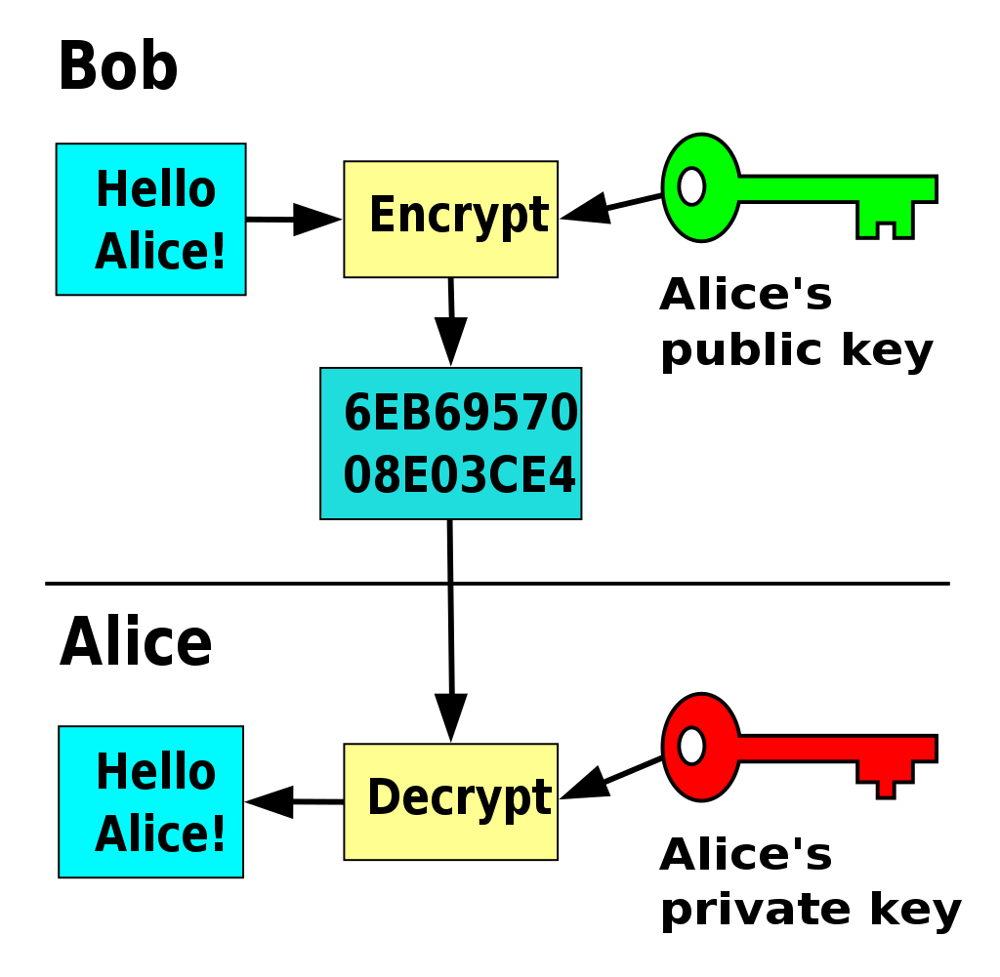
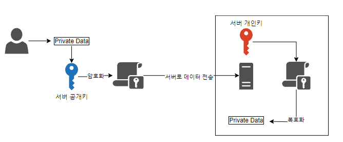
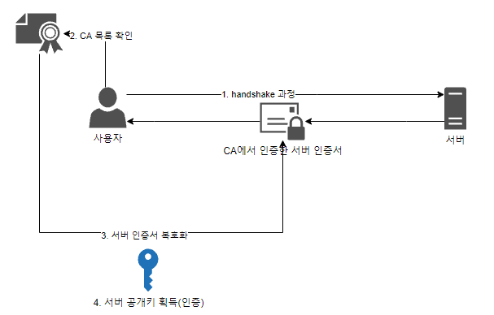

### 대칭키

- 암호화와 복호화에 사용되는 키가 동일한 암호화 방식

### 대칭키의 장점

- 구현에 용이
- 데이터를 암호화하기 위한 연산이 빨라 대용량 데이터 암호화에 적합
- 기밀성을 제공

### 대칭키의 단점

- 강한 보안을 위해 키를 주기적으로 교환해주는 것이 좋음
- 키 탈취 및 관리가 어려움
- 무결성 지원이 부분적으로만 가능
- 부인 방지 기능을 제공하지 못함

### 공개키의 종류

- LEA(Lightweight Encryption Algorithm)
- DES(Data Encryption Standard)
- AES(Advanced Encryption Standard)

### 비대칭키 (공개키)

- 암호화와 복호화에 사용되는 키가 서로 다른 암호화 방식

### 비대칭키의 장점

- 키 분배 및 키 관리가 용이
- 기밀성, 무결성을 지원
- 부인 방지 기능을 제공
- 암호학적 문제 해결
    - 보안 (공개키 암호화 → 개인키 복호화)
        - 데이터를 목적지까지 안전하게 전송할 수 있음을 보장
        
        
        
    - 인증 (개인키 암호화 → 공개키 복호화)
        - 데이터를 전송하는 곳이 신뢰할 수 있는 기관임을 보장
        - CA의 공개키를 통해, 서버가 CA의 기관 중 하나임을 확인할 수 있음
            
            
            

### 비대칭키의 종류

- **Diffie-Hellman**
- **RSA**
- **DSA**
- **ECC**

### 대칭키과 비대칭키의 혼합

1. A가 B의 공개키로 암호화 통신에 사용할 대칭키를 암호화하고 B에게 보냄
2. B는 암호문을 받고, 자신의 비밀키로 복호화함
3. B는 A로부터 얻은 대칭키로 A에게 보낼 평문을 암호화하여 A에게 보냄
4. A는 자신의 대칭키로 암호문을 복호화함
5. 앞으로 이 대칭키로 암호화를 통신함

### 혼합으로 얻는 장점

- 첫 통신 간의 비대칭키 암호화를 통해 보안에서 장점을 얻을 수 있음
- 이후에는 대칭키 방식의 암호화로 비대칭키에 비해 빠르게 암호화/복호화가 가능

출처 : [https://velog.io/@octo__/대칭키와-공개키비대칭키](https://velog.io/@octo__/%EB%8C%80%EC%B9%AD%ED%82%A4%EC%99%80-%EA%B3%B5%EA%B0%9C%ED%82%A4%EB%B9%84%EB%8C%80%EC%B9%AD%ED%82%A4)