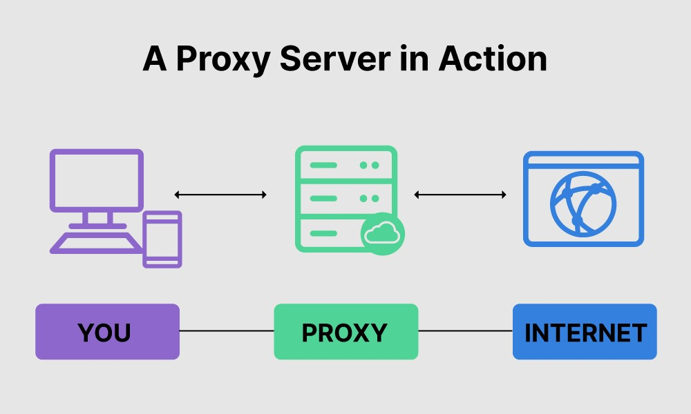
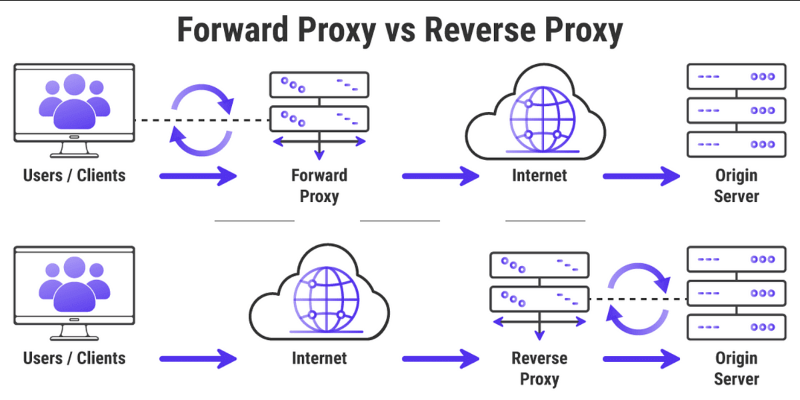

### 프록시

- 클라이언트와 서버의 연결 간의 동작하는 여러 노드와 네트워크 스택이 존재하는데, 그 중에서 응용계층에서 동작하는 것들을 일컫어 프록시라 함
- 프록시에 의해 요청이 변경되거나, 변경되지 않을 수도 있음

### 프록시의 기능

- 캐싱 (브라우저 캐시)
- 필터링 (바이러스 스캔, 유해 컨텐츠 차단 등)
- 로드 밸런싱
- 인증 (리소스에 대한 접근 제어)
- 로깅 (접속 이력 정보 저장 등)

### 프록시 서버의 종류

- Forward Proxy
    - 클라이언트와 원격 리소스 사이에 위치하여, 클라이언트의 요청을 대신해서 서버에 전송
    - 대역폭 감소 및 접근 정책 구현에 장점을 가짐
- Reverse Proxy
    - 프록시 서버를 인트라넷 리소스 앞에 위치시키는 방식
    - 보안적인 측면 및 로드밸런싱에서 장점을 가짐

출처 : https://developer.mozilla.org/ko/docs/Web/HTTP/Overview

출처 : [https://velog.io/@jangwonyoon/Proxy-Server프록시-서버란](https://velog.io/@jangwonyoon/Proxy-Server%ED%94%84%EB%A1%9D%EC%8B%9C-%EC%84%9C%EB%B2%84%EB%9E%80)