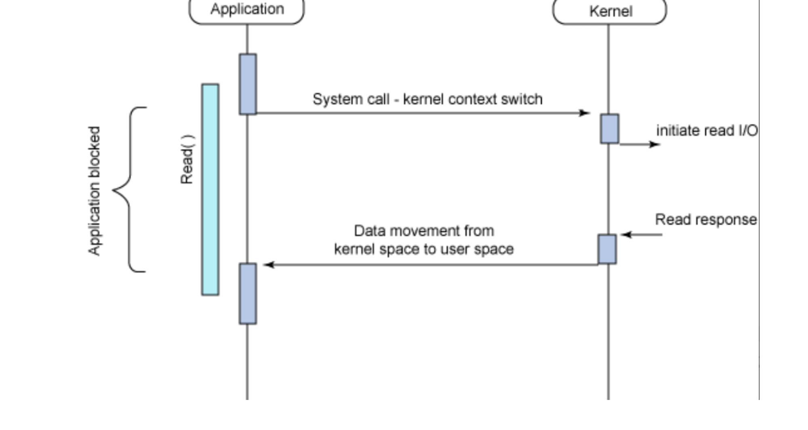
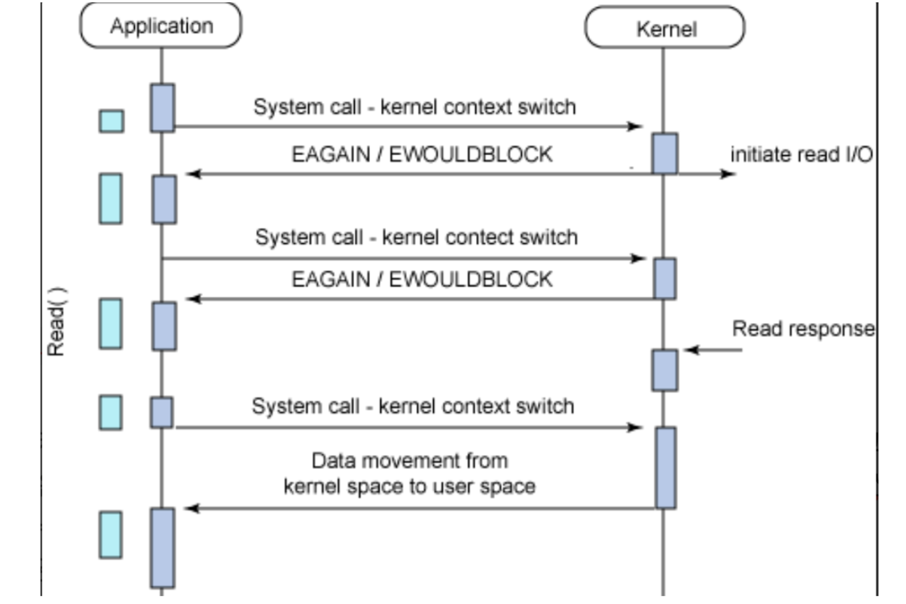
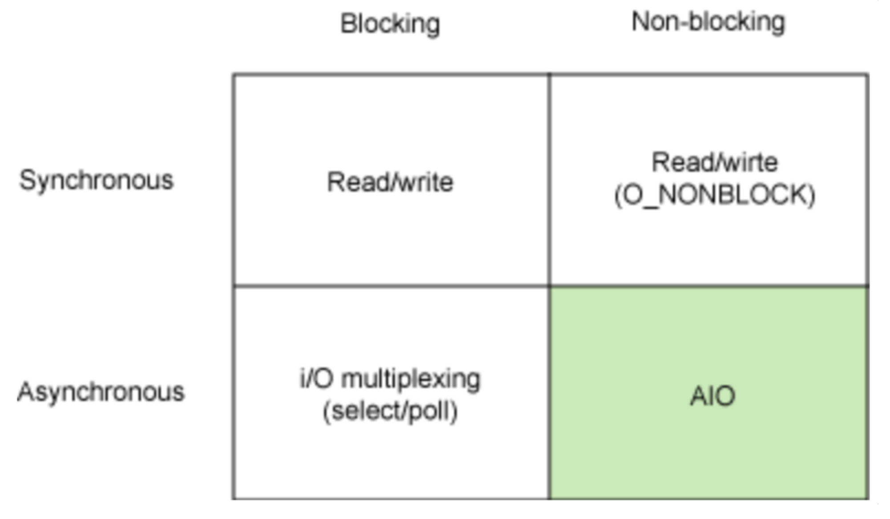

## Blocking I/O & Non-Blocking I/O에 대해 설명해주세요. 
**Sync와 Async의 차이는 그것을 요청한 순서가 지켜지는가 아닌가에 있고(응답 순서대로 오는가) Blocking와 Non-blocking은 그 요청에 대해 받은 쪽에서 처리가 끝나기 전에 리턴해주는가 아닌가에 달려 있습니다.**

### Blocking I/O
- I/O 작업이 진행되는 동안 유저 프로세스가 자신의 작업을 중단한채로 I/O가 끝날때까지 대기하는 방식을 의미한다.
- 호출된 함수가 자신의 작업을 모두 마칠 때까지 호출한 함수에게 제어권을 넘겨주지 않고 대기하게 하는 방식
- 자신의 작업을 진행하다가 다른 주체의 작업이 시작되면 다른 작업이 끝날 때까지**기다렸다**가 자신의 작업을 시작하는 것
- 어플리케이션은 read 함수가 끝날때까지 작업이 블로킹 되어 다른 작업을 진행하지 못한다.

### Non-Blocking I/O
- non blocking I/O란 A함수가 I/O작업을 호출했을 때 I/O작업이 완료될까지 A함수의 작업을 중단하지 않고 I/O 호출에 대해 즉시 리턴하고, A함수가 이어서 다른 일을 수행할 수 있도록 하는 방식을 의미한다
- 호출된 함수가 바로 리턴해서 호출한 함수에게 제어권을 넘겨주고, 호출한 함수가 다른 일을 할 수 있는 기회를 줄 수 있는 방식
- 다른 주체의 작업에**관련없이**자신의 작업을 하는 것

### sync & blocking

- blocking: 작업을 요청하면 일단 요청한 쪽은 일단 block이 되고, 작업이 완료가 된후에 응답을 받을수 있음. 그렇기에 완료가 되기 전에는 요청한 쪽은 block이 되어 다른 작업을 수행하지 못함.
- non-blocking: 작업을 요청하면, 즉시 응답이 돌아옴
- 동기(sync): 작업을 요청한 측에서 작업의 완료 여부를 체크함.
- 비동기(async): 작업을 요청 받은 측에서 작업의 완료 여부를 알려줌

출처 :  
[blocking I/O, non-blocking I/O에 대하여 (sync, async와의 차이)](https://etloveguitar.tistory.com/140)  
[Blocking/Non-Blocking I/O && I/O 이벤트 통지 모델](https://velog.io/@octo__/BlockingNon-Blocking-IO-IO-이벤트-통지-모델)