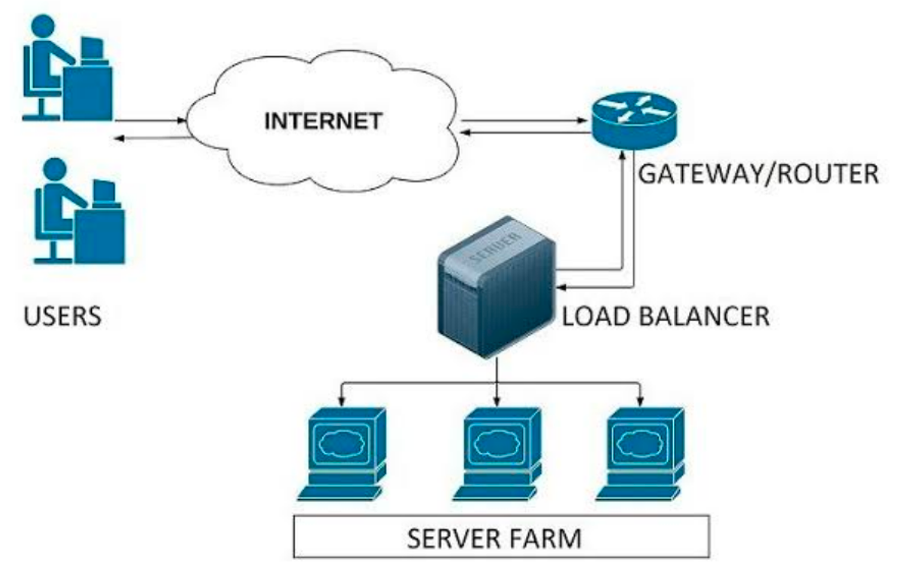

## 로드 밸런싱(Load Balancing)에 대해 설명해주세요.

- 서버가 처리해야할 업무 혹은 요청(Load)를 여러 대의 서버로 나누어서(Balancing) 처리하는 것
      - 한 서버가 일을 다 처리하면 부담스러우니, 여러 서버에게 일을 나누겠다!
- 한 대의 서버로 부하가 집중되지 않도록 트래픽을 관리
- Layer 4, Layer 7 - [출처](https://kth990303.tistory.com/355)
    - L4 로드 밸랜서: 빠르고 정확
        - L4 로드 밸랜서는 IP 주소, TCP/UDP 프로토콜, 포트 번호, MAC 주소 등을 기반으로 트래픽을 분산합니다. 이를 위해 IP 해싱 기법과 같은 알고리즘을 사용합니다. L4 로드 밸랜서는
          빠른 성능으로 알려져 있으며 고처리량 환경에서 효율적인 트래픽 분배를 제공합니다.
    - L7 로드 밸랜서: 데이터 분석으로 스마트 분배와 보안
        - L7 로드 밸랜서는 URL, 페이로드 내용, 쿠키, HTTP 헤더 등을 분석하여 트래픽을 분산합니다. 이러한 분석을 통해 L7 로드 밸랜서는 똑똑한 트래픽 분배 결정을 내릴 수 있습니다. 또한,
          비정상 트래픽을 필터링하여 DDoS 공격을 방지할 수 있습니다. 그러나 이러한 세밀한 분석으로 인해 L7 로드 밸랜서는 더 많은 자원을 소모하며 L4 로드 밸랜서에 비해 성능이 느릴 수 있습니다.

- 기본기능
    1. 상태 확인(Health Check)
       서버들에 대한 주기적인 상태 확인을 통해 서버들의 장애 여부를 판단하며, 정상 동작 중인 서버로만 트래픽을 보낸다.
    2. 터널링(Tunneling)
       데이터 스트림을 인터넷 상에서 가상의 파이프를 통해 전달시키는 기술. 연결된 상호 간에만 캡슐화된 패킷을 구별해 캡슐화를 해제
    3. NAT
       내부 네트워크에서 사용하는 사설 IP 주소와 로드밸런서 외부의 공인 IP 주소 간의 변환 역할

- 알고리즘
    1. 라운드 로빈 방식
       서버에 들어온 요청을 순서대로 돌아가며 매칭
    2. 가중 라운드 로빈 방식
       가중치가 높은 서버에 클라이언트 요청을 우선적으로 배분
    3. IP 해시 방식
    4. 최소 연결 방식
    5. 최소 응답 방식
    6. 대역폭 방식

[로드밸런서(Load Balancer)의 개념과 특징](https://m.post.naver.com/viewer/postView.naver?volumeNo=27046347&memberNo=2521903)  
[로드 밸런서(Load Balancer)란?](https://nesoy.github.io/articles/2018-06/Load-Balancer)