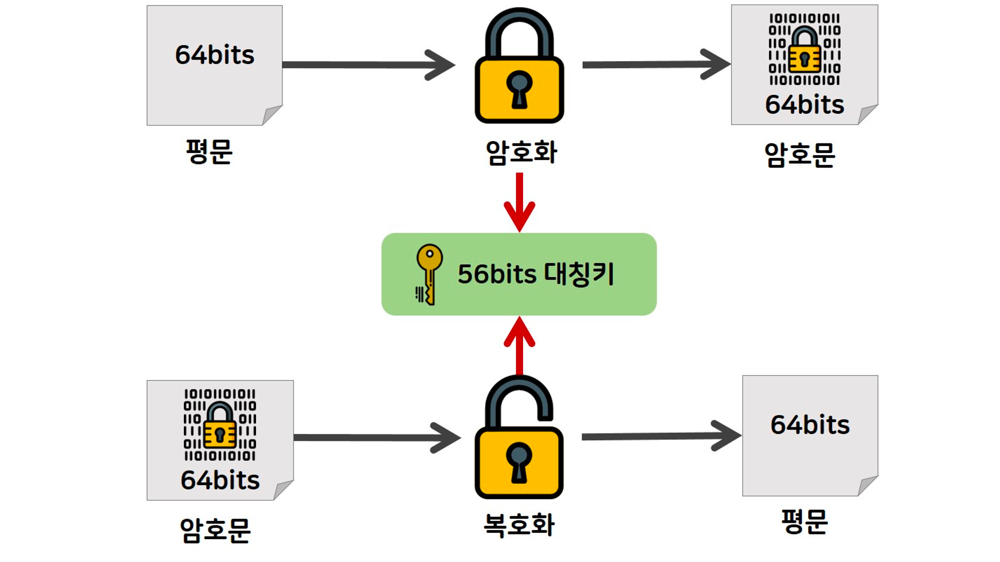
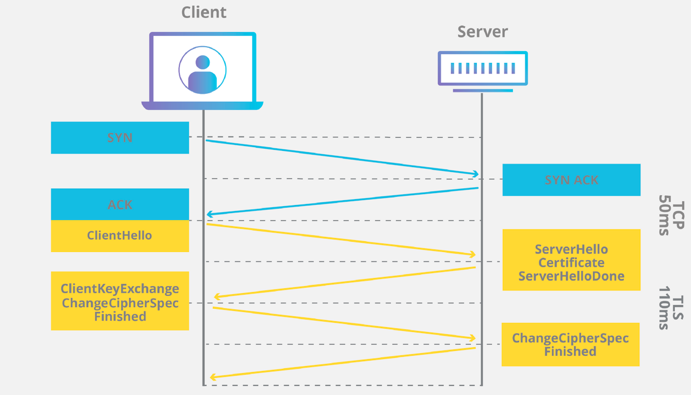
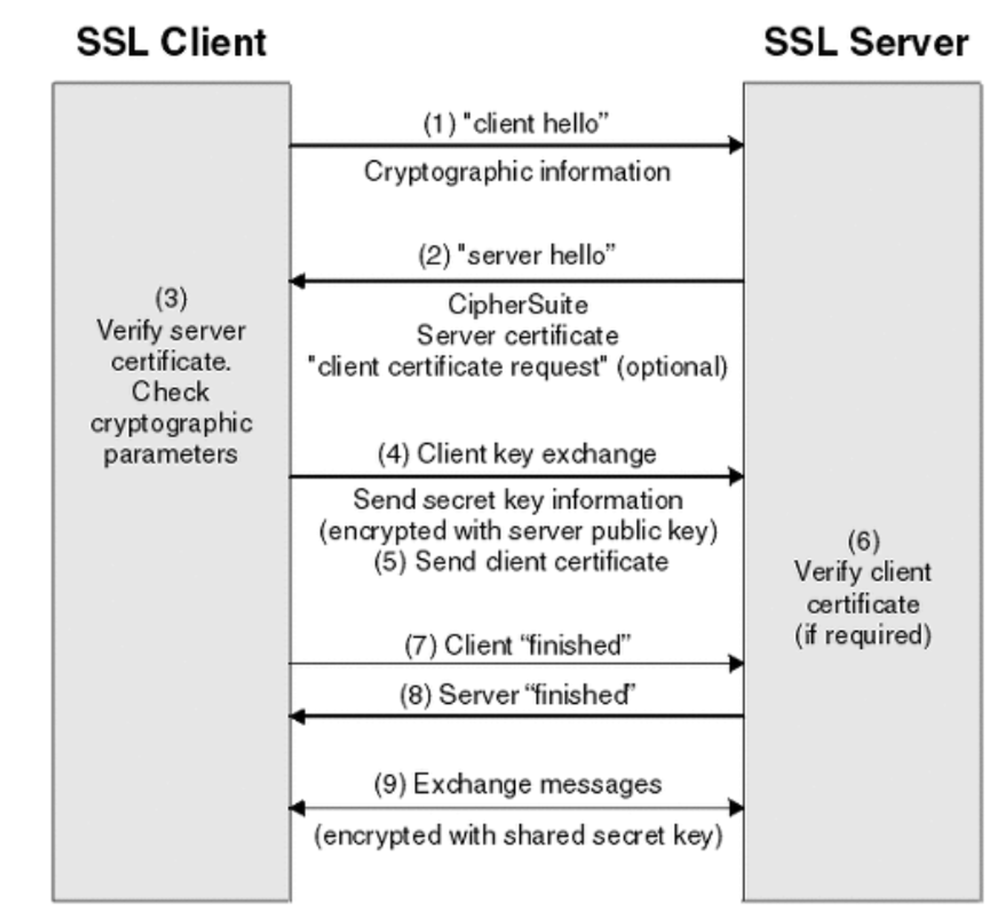

## 비대칭키 또는 공개키 암호화 방식은 무엇인가요?
### 대칭키

- 키 = 암호화를 진행할 때 사용되는 비밀번호
- 암호화할 때 사용되는 키와 복호화할 때 사용되는 키가 동일한 암호화 기법이다.
- 장점
  - 데이터를 암호화하기 위한 연산이 빨라 대용량 데이터 암호화에 적합
  - 기밀성을 제공
- 단점
  - 사용되는 키의 공유가 어렵다.
    - 암호화된 메세지를 상대가 복호화할 수 있게 하기 위해서는 적어도 한번은 대칭키의 공유가 이루어져야하는데, 이 과정에서 대칭키가 유출되면 키를 획득한 사람은 누구나 복호화할
      수 있기 때문에 어렵다.
- 종류
  - DES(Data Encryption Standard)
  - 3DES
  - AES(Advanced Encryption Standard)
  - SEED
  - ARIA

### 공개키(비대칭키)

- 암호화할 때 사용하는 키와 복호화할 때 사용하는 키카 다르다
- 하나는 공개키, 하나는 개인키
- 자신이 가지고 있는 고유한 개인키로만 복호화할 수 있는 공개키를 공개
  - n명의 사용자로 구성된 네트워크를 고려하면 각 사용자는 공개키와 개인키 두 개를 보유하고 있으므로 네트워크 전체적으로 2n개의 키가 요구됩니다. 각 유저는 2개의 키만 보유하고 있으면 됩니다.
- 장점
  - 키 분배 및 키 관리가 용이
  - 기밀성, 무결성을 지원
  - 부인 방지 기능을 제공
- 단점
    - 서로 다른 방법으로 암호화,복호화를 사용해서 리소스가 필요하다.(시간이 더 많이 든다)
- 진행과정
    1. A가 공개된 ‘B의 공개키’로 암호화해서 B에게 보냄
    2. B는 자신의 개인키로 내용을 확인하고 ‘A의 공개키’로 응답을 암호화해서 A에게 보냄
    3. A는 자신의 개인키로 암호화된 응답을 복호화
- 종류
    - RSA
    - 디피-헬만
    - 타원곡선암호
    - 전자서명

### HTTPS의 동작방식

- 공개키(비대칭키) 암호화 방식과 공개키의 느리다는 단점을 보완한 대칭키 암호화(세션키) 방식을 함께 사용한다. **공개키 방식으로 대칭키를 전달하고, 서로 공유된 대칭키를 가지고 통신하게 된다.**
- HTTP를**SSL(Secure Sockets Layer) 프로토콜**위에서 돌아가도록하여 클라이언트와 서버가 주고받는 텍스트를 암호화합니다. SSL은 TLS(Transport Layer Security)라는 또
  다른 프로토콜의 이전 버전입니다

1. A라는 서버를 만드는 기업이 HTTPS를 적용하기 위해 공개키와 개인키를 만듭니다.
2. 신뢰할 수 있는 CA 기업에 공개키 관리를 부탁하며 계약을 맺습니다.
3. 계약이 완료된 CA 기업은 A 서버의 공개키, 해당 기업의 이름, 공개키 암호화 방법을 담은 인증서를 만들고 해당 인증서를 CA 기업의 개인키로 암호화해서 A 서버에게 제공합니다.
4. A 서버는 직접적인 공개키가 아닌 암호화된 인증서를 보유하게 되었습니다.
5. 클라이언트가 통신 요청을 보내면 앞선 SSL/TLS Handshake 과정을 수행하여 연결을 수립합니다.
6. 클라이언트와 A 서버와 통신을 시작합니다.

출처,참고  
[블로그](https://inuplace.tistory.com/1086)  
[https://velog.io/@gs0351/대칭키-vs-공개키비대칭키](https://velog.io/@gs0351/%EB%8C%80%EC%B9%AD%ED%82%A4-vs-%EA%B3%B5%EA%B0%9C%ED%82%A4%EB%B9%84%EB%8C%80%EC%B9%AD%ED%82%A4)