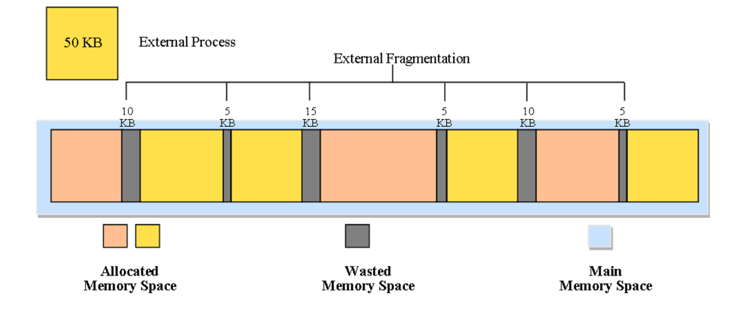
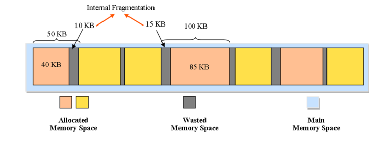
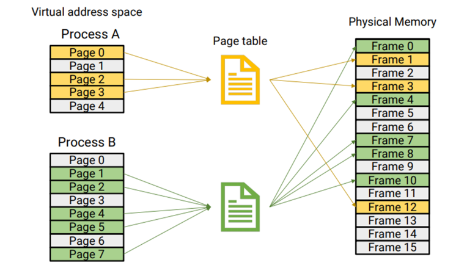
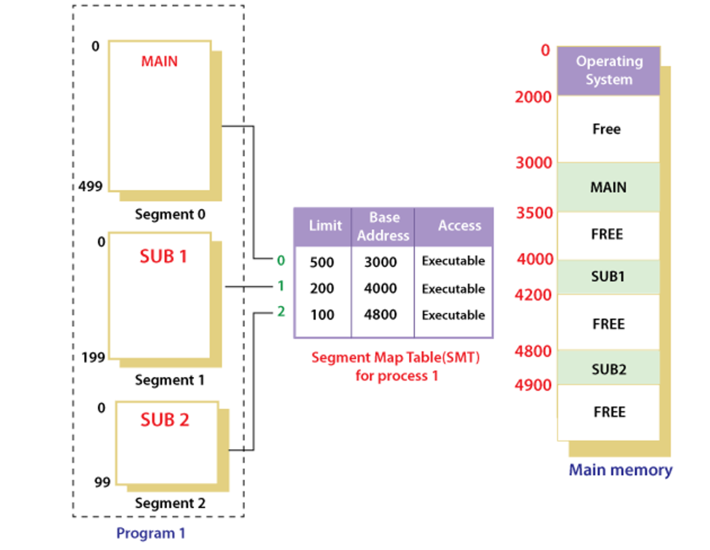

## 사전 지식 - 메모리 관리 기법

### 연속 메모리 기법

- 프로그램 전체가 메모리에 연속적으로 할당

- 고정 분할 기법: 메모리가 고정된 파티션으로 분할. 내부 단편화 발생

- 동적 분할 기법: 파티션들이 동적으로 생성되고 자신의 크기와 같은 파티션에 메모리 할당. 외부 단편화 발생

### 불연속 메모리 기법

- 프로그램의 일부가 서로 다른 주소 공간에 할당될 수 있는 기법

- Page: 프로세스를 고정된 크기로 나눈 블록

- Frame: 메모리를 고정된 크기로 나눈 블록

- Segment: 서로 다른 크기의 논리적 블록

## 메모리 단편화가 무엇인가요?

메모리 단편화란 메모리의 공간이 작은 조각으로 나뉘어져 충분히 사용 가능한 메모리가 있음에도 시스템이 메모리 할당을 할 수 없는 상태를 의미한다.

메모리 단편화가 발행하는 원인에 따라 **내부 단편화**와 **외부 단편화**로 구분할 수 있다.

## 외부 단편화가 무엇인가요?

메모리가 할당되고 해제되는 작업이 반복될 때, 작은 메모리가 남게 된다. 이러한 메모리 공간들이 많아지면서 **총 사용 가능한 메모리 공간은 충분하지만 실제로 할당할 수 없는 상황**을 외부 단편화라고 한다.

## 내부 단편화가 무엇인가요?

내부 단편화는 필요한 양보다 더 큰 메모리가 할당이 되어서 **할당 된 메모리 내부에 사용하지 않는 메모리 공간이 발생한 상황**을 뜻합니다.

## 메모리 단편화를 어떻게 해결할 수 있나요?

### 1.페이징 기법 (가상 메모리 사용, 외부 단편화 해결, 내부 단편화는 여전히 존재)

**페이징 기법**은 고정 분할 방식을 이용한 가상 메모리 관리 기법으로, 물리 주소 공간을 같은 크기의 메모리 영역으로 나누어 사용한다. 이때 가상 주소는 프로세스 입장에서 바라본 메모리 공간으로 항상 0번지부터 시작한다. 가상 주소의 분할된 각 영역을 **페이지**라고 하며, 물리 메모리의 각 영역은 **프레임**이라고 한다. 물리 메모리 단위로 가상 메모리를 할당하기 때문에 페이지 크기와 프레임 크기는 같다.

페이지와 프레임을 대응 시키는 과정을 page mapping이라고 하며, 이를 위해 paging table이 있다. 페이징 기법을 사용하면 연속적이지 않은 공간도 활용할 수 있기 때문에 외부 단편화 문제를 해결할 수 있다. 대신 항상 페이지 단위에 맞춰 메모리를 꽉 채워 쓸 수 없으므로 내부 단편화 문제는 여전히 존재한다. (페이지 단위를 작게하면 내부 단편화 문제도 해결할 수 있지만 Page mapping 과정이 많아지므로 오히려 효율이 떨어진다.)

### 2.세그멘테이션 기법 (가상 메모리 사용, 내부 단편화 해결, 외부단편화 존재)

페이징 기법에서 가상 메모리를 일정한 크기의 블록(페이지)로 분할했다면, 세그먼테이션 기법에서는 가상 메모리를 서로 크기가 다른 논리적 단위인 세그먼트로 분할해서 메모리 할당을 하고, 실제 메모리 주소로 변환한다.

각 세그먼트는 연속적인 공간에 저장되어 있다. 세그먼트들의 크기가 다르기 때문에 미리 분할해 둘 수 없고 메모리에 적재될 때 빈 공간을 찾아 할당한다.

페이지와 마찬가지로 mapping을 위해 segment table이 필요하다. table에는 각 세그먼트 항목별로 세그먼트 시작 주소와 세그먼트의 길이 정보를 가지고 있다.

프로세스가 요구하는 메모리 크기에 맞게 할당하기 때문에 내부 단편화는 일어나지 않지만, 중간에 프로세스가 메모리를 해제하면 생기는 구멍, 즉, 외부 단편화 문제는 여전히 존재한다.

### 3. 메모리 풀(Memory Pool)

필요한 메모리 공간을 적절한 크기, 개수만큼 사용자가 직접 지정하여 미리 할당받아 필요할 때마다 사용하고 반납하는 방법이다.

메모리 풀 없이 동적 할당과 해제를 반복하면 메모리의 랜덤한 (실제로는 알고리즘에 의한) 위치에 할당과 해제가 반복되면서 단편화를 일으킬 수 있겠지만, 미리 공간을 할당해놓고 가져다 쓰고 반납하기 때문에 할당과 해제로 인한 외부 단편화가 발생하지 않는다.

또한 필요한 크기만큼 할당 하기 문에 내부 단편화 또한 생기지 않는다.

하지만 메모리 단편화로 인한 메모리 낭비량보다 메모리 풀을 만들었지만 쓰지 않았을 때 메모리 낭비가 심하므로 메모리 할당, 해제가 잦은 경우 사용하면 효과적이다.
아올 경우 헤더 포인터는 그 블록을 가리키고 방금 전까지 헤더 포인터가 가리키던 블록을 돌아온 블록의 다음 포인터가 가리키게 한다.