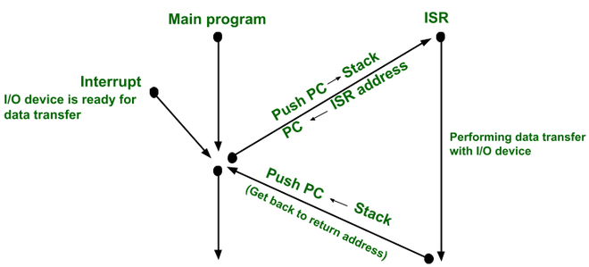

## 인터럽트

- CPU 실행 중 발생하는 내부, 외부적 신호로 현재 처리되고 있는 작업보다 앞서 처리를 요청하는 신호

## 인터럽트의 종류

### 내부 인터럽트

- 하드웨어 고장
- 명령어 실행 오류
- 전원 이상 등

### 외부 인터럽트

- 입출력장치 (키보드, 마우스, 디스크 등)

## 인터럽트 서비스 루틴

- 인터럽트가 발생 후 이를 처리하기 위한 과정
- 처리 순서
    
    
    
    1. 프로그램 수행 중 인터럽트 발생
    2. 현재 프로그램의 상태를 저장
    3. 인터럽트 벡터로 이동 후 처리
    4. 인터럽트 처리가 완료된 이후 복귀주소로 이동
    5. 마지막으로 실행되었던 프로그램 로드 후 실행

출처

- [https://velog.io/@pppp0722/인터럽트Interrupt란](https://velog.io/@pppp0722/%EC%9D%B8%ED%84%B0%EB%9F%BD%ED%8A%B8Interrupt%EB%9E%80)
- [https://whatisthenext.tistory.com/147#마무리](https://whatisthenext.tistory.com/147#%EB%A7%88%EB%AC%B4%EB%A6%AC)