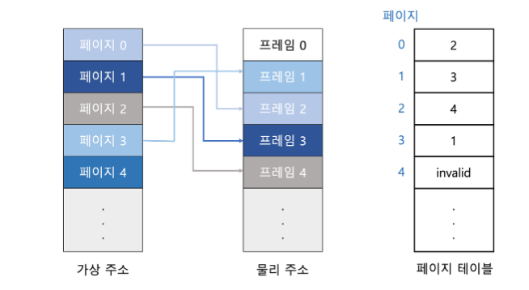
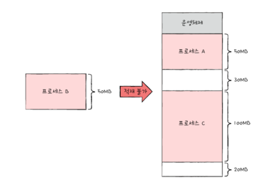
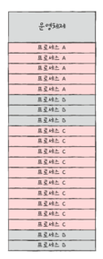

## 페이징 기법에 대해 설명해주세요

### 페이징 기법이 무엇인가요?

---
페이징은 프로세스의 논리 주소 공간을 `페이지`라는 일정한 단위로 자르고,
메모리 물리 주소 공간을 `프레임`이라는 페이지와 동일한 크기의 일정한 단위로 자른 뒤
페이지를 프레임에 할당하는 가상 메모리 관리 기법입니다.

 

### 페이징 기법은 왜 등장했나요?

---
메모리 공간에 연속적으로 프로세스를 할당하는 방식의 문제점은 두 가지가 있습니다.

1. 외부 단편화 발생
2. 메모리보다 큰 프로세스를 실행 불가능

이 문제점들을 해결하기 위해 등장한 기술이 `가상 메모리`입니다. 
가상메모리는 실행하고자 하는 프로그램의 일부만 메모리에 적재하여 실제 물리 메모리보다 큰 프로세스를 실행하게 도와주는 기술입니다.

이 가상 메모리 관기 기법 중 현대의 대부분의 운영체제가 사용하는 기법이 `페이징`입니다.

 

### 페이징 과정이 어떻게 이루어지나요?

---
연속 메모리 할당 방식에서 외부 단편화가 생긴 근본적인 이유는 각기 다른 크기의 프로세스가 메모리에 연속적으로 할당되었기 떄문입니다.
만일 메모리와 프로세스를 일정한 단위로 자르고, 이를 메모리에 불연속적으로도 할당할 수 있다면 외부 단편화는 발생하지 않습니다.

예를 들어, 위 그림에서 메모리 공간과 프로세스를 10MB 단위의 일정한 크기로 자르고, 잘린 메모리 조각들에 프로세스 조각들을 불연속적으로 적재할 수 있다면 오른쪽 그림과 같이 외부 단편화는 발생하지 않습니다.

 

### 페이징 기법의 장점은 무엇인가요?

---
- <u>외부 단편화를 해결</u>할 수 있어 메모리를 효율적으로 사용할 수 있습니다.
- 메모리를 할당할 때, 메모리의 크기가 프로세스의 크기보다 작더라도 프로세스를 실행할 수 있습니다.

 

### 페이징 기법의 단점은 무엇인가요?

---
- 프레임의 모든 공간을 사용하지 않을 경우 <u>내부 단편화가 발생</u>합니다.
- 적절한 페이지 교체 알고리즘을 사용하지 않을 경우 페이지 부재가 발생할 수 있습니다.
