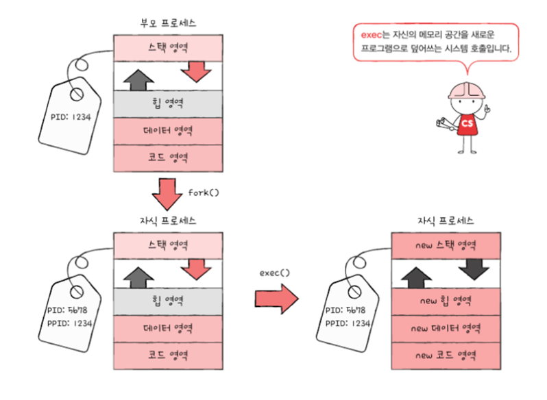
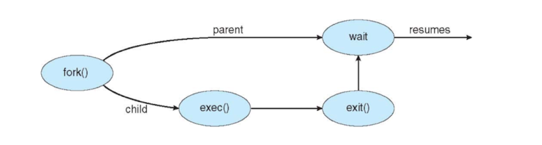
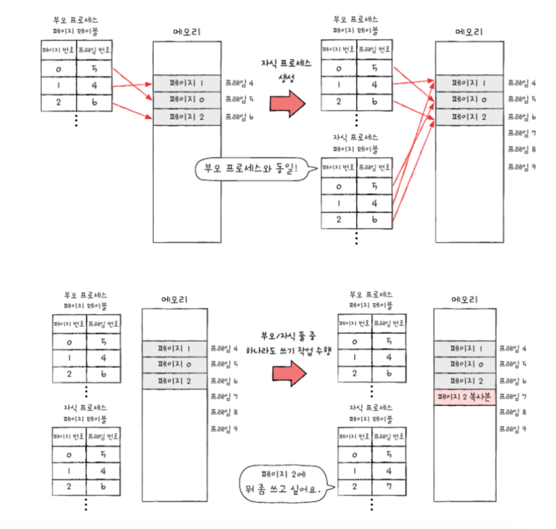

## 프로세스는 누구에 의해 어떻게 생성되나요?

프로세스는 실행 도중에 시스템 호출을 통해 다른 프로세스를 생성할 수 있다. 이 때, 생성한 프로세스를 부모 프로세스, 생성된 프로세스를 자식 프로세스라고 한다.

부모 프로세스는 자식 프로세스와 엄연히 다른 프로세스이기에 각기 다른 PID를 가진다. 일부 운영체제에서는 자식 프로세스의 PCB에 부모 프로세스 PID인 PPID를 기록하기도 한다.

운영체제는 이러한 프로세스의 구조를 트리 형태로 관리하는데 이를 프로세스 계층 구조하고 한다.

*최초의 프로세스는 유닉스 운영체제에서는 init, 리눅스는 systemd, macOS에서는 launchd라고 한다. PID는 항상 1번이며 모든 프로세스의 최상단에 위치한다.

## 생성 기법에 대해 자세히 설명해주세요.

프로세스 생성 기법은 fork()와 exec() 두 시스템 호출로 이루어진다.

부모 프로세스는 fork를 통해 자신의 복사본을 자식 프로세스로 생성하고 자식 프로세스는 exec를 통해 자신의 메모리 공간을 다른 프로그램으로 교체한다. 

좀 더 명확하게 설명하면 자식 프로세스가 부모 프로세스로부터 할당받은 메모리 공간에 새로운 프로그램을 로드해서 메모리를 초기화한 뒤, 그 프로그램에 대한 프로세스를 시작한다.

## 생성 과정에서 발생할 수 있는 문제점은 무엇인가요?

만약 부모 프로세스가 먼저 끝난다면 자식 프로세스는 어떻게 될까? 이론상으로는 부모 프로세스가 자식 프로세스보다 먼저 종료되면 자식 프로세스는 곧바로 종료되어야 한다. 마치 main 함수가 return된 상황과도 같다. 이러한 상황을 방지하기 위해 wait()이라는 시스템 콜이 존재한다.

wait은 자식 프로세스가 종료될 때까지 부모 프로세스가 대기하도록 하는 명령어이다.

## 쓰기 시 복사란 무엇인가요?

fork()를 하면 부모 프로세스의 페이지들을 실제로 자식 프로세스에 복사해 줌으로써 자식 프로세스의 주소 공간을 구성해 주고 대부분의 자식 프로세스들은 주소 공간이 마련되자마자 exec() 시스템 호출 한다. 그러면 부모로부터 복사해온 페이지들은 다 쓸모 없는 것들이 되고 만다.

이러한 문제를 해결할 수 있는 기법이 “쓰기 시 복사”이다. 

쓰기 시 복사에서는 부모 프로세스와 자식 프로세스가 동일한 프레임을 가리킨다. 이로써 굳이 부모 프로세스의 메모리 공간을 복사하지 않고도 동일한 코드 및 데이터 영역을 가리킬 수 있다. 이 상태에서 만약 부모 프로세스 혹은 자식 프로세스 둘 중 하나가 페이지에 쓰기 작업을 하면 그 순간 해당 페이지가 별도의 공간으로 복제된다. 이러한 방식을 통해 프로세스의 생성 시간을 줄이는 것은 물론 메모리 공간 절약이 가능하다.

