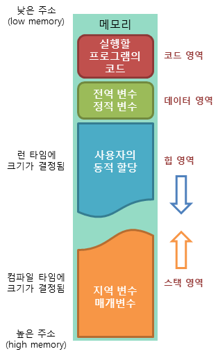

1. 코드
    - 실행하는 프로그램의 소스코드가 저장되는 공간
2. 데이터 영역
    - 전역 변수, 정적 변수등이 저장되는 공간
3. 힙 영역
    - 사용자가 임의로 사용할 수 있는 저장공간
    - 런타임시 크기가 변동될 수 있음
    - 힙이 heap으로 불리는 이유
        - [사전적 의미와 동일, 다만 자료구조의 heap과는 별개](https://stackoverflow.com/questions/756861/whats-the-relationship-between-a-heap-and-the-heap)
            - heap : 무언가를 쌓아올린 덩어리, 집합
        - [과거에 메모리에서 사용가능한 영역 중 일부를 heap이라고 부른 데서 유래](https://stackoverflow.com/questions/1699057/why-are-two-different-concepts-both-called-heap)
4. 스택 영역
    - 컴파일 시 크기가 결정
    - 지역 변수와 같이 스코프가 정해져있는 변수들이 저장되는 공간