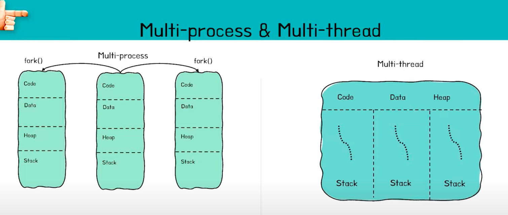

## 멀티 스레드와 멀티 프로세스에 대해서 설명해주세요

- 출처 : https://www.youtube.com/watch?v=1grtWKqTn50&ab_channel=우아한테크

### 프로세스

프로세서에서 실행하고 있는 프로그램, 실행되고 있는 프로그램(상태)으로 독립된 메모리 공간과 자원을 가지고 있다. 프로세스는 생성, 종료, 상태 전이를 통해 작업을 수행하고 프로세스간 통신과 동기화 작업을 통해
협력적으로 동작한다. 스레드 단위 작업을 지원하기 위한 자원 할당의 단위

### 멀티 프로세스

- 여러개의 ‘프로세스’, 즉 멀티 프로세스를 통해 한프로그램 내에서 동시에 두 가지 이상의 일을 수행할 수 있는것을 말한다.
- 장점
  - 여러 개의 자식 프로세스 중 하나에 문제가 발생하면 그 자식 프로세스만 죽는 것 이상으로 다른 영향이 확산되지 않는다.
- 단점
  - 위에서 부모 프로세스가 여러 작업으로 나눠지는 경우 프로세스가 여러개로 나눠질 수 있다고 했다. 이 경우 프로세스는 모두 각각의 PCB를 가지고, 콘텍스트 스위치시에 모두 다시 올려야하는 시간이 길어 매우 비
    효율적이다. 또한 부모 프로세스에서 여러 작업으로 나눠진 경우 서로 통신하기 위해서 IPC 통신 방법을 사용하여야 하는데 이 방법 또한 비효율적이다 → 스레드 출동

### 스레드

프로세스 내에서 실제 작업을 수행하는 주체로 프로세스의 자원을 공유하여 효율적인 작업을 수행합니다. 스레드는 멀티스레딩, 단일 스레드, 다중 스레드 등의 모델로 사용된다

### 멀티 스레드(멀티 스레딩)
- 일반적으로 하나의 프로세스는 하나의 스레드를 가지고 작업하지만 두 개 이상의 스레드가 동시에 작업하는 것을 의미한다. (한 프로그램 안에서 병렬 처리 하는 것)
- 장점 
  - 프로세스를 생성하는 비용보다 싸다
  - 메모리를 공유해서 효율적이다. 스택 영역만 다시 올리면 된다
  - 간단한 통신 방법으로 인한 프로그램 응답 시간이 단축된다.
- 단점 
  - 구현이 어렵다, 동기화 문제가 발생할 수 있다.
  - 디버깅이 까다롭다
  - 하나의 스레드에 문제가 발생하면 전체 프로세스가 영향을 받는다.

