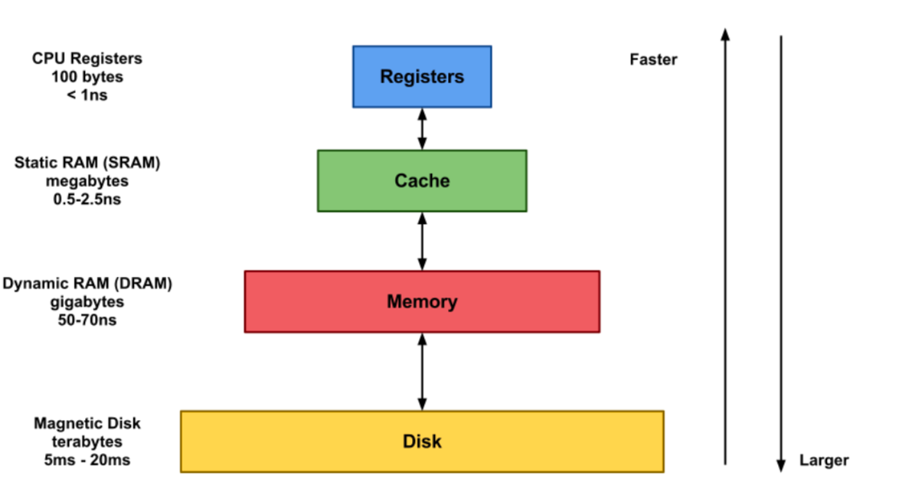

## 캐시와 레지스터의 차이점에 대해 설명해주세요

이미지 출처, 참고 : https://melonicedlatte.com/computer/2018/11/07/190754.html

### 캐시

- CPU와 메인 메모리 사이 에서 두 속도 차이로 인해 병목 현상을 줄이기 위해 사용되는 범용 메모리이다.
- 자주 사용하는 데이터나 값을 복사해 두는 임시 저장소이다.( 캐시의 접근 시간에 비해 원래 데이터를 접근하는 시간이 오래걸리는 경우등에 대비해서 시간을 절약하고 싶은 경우에 사용된다.
- 저장공간이 작고 비용이 비싸지만 빠른 성능을 제공한다
- 3개의 레이어로 나뉘어져 L1,L2,L3로 여러 단게로 나뉘어서 숫자가 작을수록 용량이 작고 빠르다
- 프로그램에서 직접적으로 읽거나 쓸 수 없고 MMU가 내부적 으로 제어합니다.
- 여기서 다시 사용할 가능성을 이야기 하면서 적중률의개념이 사용된다.공통점이 무엇인가요?

### 레지스터
- 메모리 계층의 최상위에 위치하며 가장 빠른속도로 접근 가능하다
- CPU가 요청을 처리하는 데이터의 임시저장 공간
- 작고 비싸지만 연산속도가 아주 빠르다
- 레지스터의 종류
    - AC (Accumulator) :연산 결과 데이터를 일시적으로 저장하는 레지스터
    - IR (Instruction Register) :가장 최근에 인출된 명령어(현재 실행 중인 명령어)가 저장되어 있는 레지스터
    - MAR (Memory Address Register) :PC에 저장된 명령어 주소가 사용되기 전에 일시적으로 저장되는 주소 레지스터
    - MBR (Memory Buffer Register) :기억장치에 저장될 데이터 혹은 읽혀진 데이터가 일시적으로 저장되는 버퍼 레지스터

#### 공통점
`어떤 명령어나 데이터를 저장해두는 저장 공간`이라는 것이다.

#### 차이점
캐시는 CPU와 별도로 존재하는 공간이며 메인 메모리와 CPU간의 속도 차이를 극복하기 위해 존재하는 저장공간이며 
레지스터는 CPU 안에서 연산을 처리하기 위해 데이터를 저장하는 공간이라는 것이다.
- Long Tail 법칙 ( 자주 요구하는 데이터중 20프로정도 요구한것이 시스템 리소스의 대부분을 차지한다)

---
### 참고 
[참고 링크](https://melonicedlatte.com/computer/2018/11/07/190754.html)
