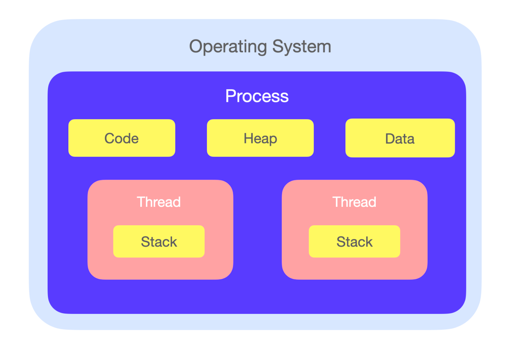

## 프로세스와 스레드

### 프로세스(Process) : 실행 중인 프로그램, 컴퓨터에서 실행되고 있는 프로그램

- 메모리에 올라와 실행되고 있는 프로그램 인스턴스
- 운영체제로 부터 시스템 자원을 할당받는 단위
- 각 프로세스는 각각의 분리된 메모리 영역(Text, Data, BSS, Heap, Stack)을 가진다.
- 기본적으로는 프로세스 1개당 1개의 스레드를 가진다( 즉 스레드는 프로세스에 안에서 )
- IPC(Inter process communication) : 한 프로세스와 다른 프로세스가 통신하는 방법
- 커널 내에 준비 큐, 대기 큐, 실행 큐 등의 자료구조를 활용하여 프로세스의 상태를 관리한다.

### ️스레드 : 프로세스 내에서 실제로 작업을 수행하는 주체
- 모든 프로세스는 한 개 이상의 스레드가 있다.
- 프로세스가 할당받은 자원을 이용하는 실행의 단위
- 자신이 속한 프로세스의 메모리(code, data, heap)을 공유한다. stack만 따로 할당받는다.(프로세스는 공유하지 않는다. 자신만의 독립된 메모리 공간을 이용하고 다른 프로세스의 메모리에 직접 접근이 불가능하다.)
- 각 스레드가 프로세스의 메모리를 공유하여 사용하기 때문에 시스템의 낭비가 적어진다.
- 즉 스레드는 프로세스내에서 실제로 작업을 실행하는 주체이고 프로세스는 메모리를 공유하지 않지만 스레드는 메모리를공유해서 시스템의 낭비가 적어진다.