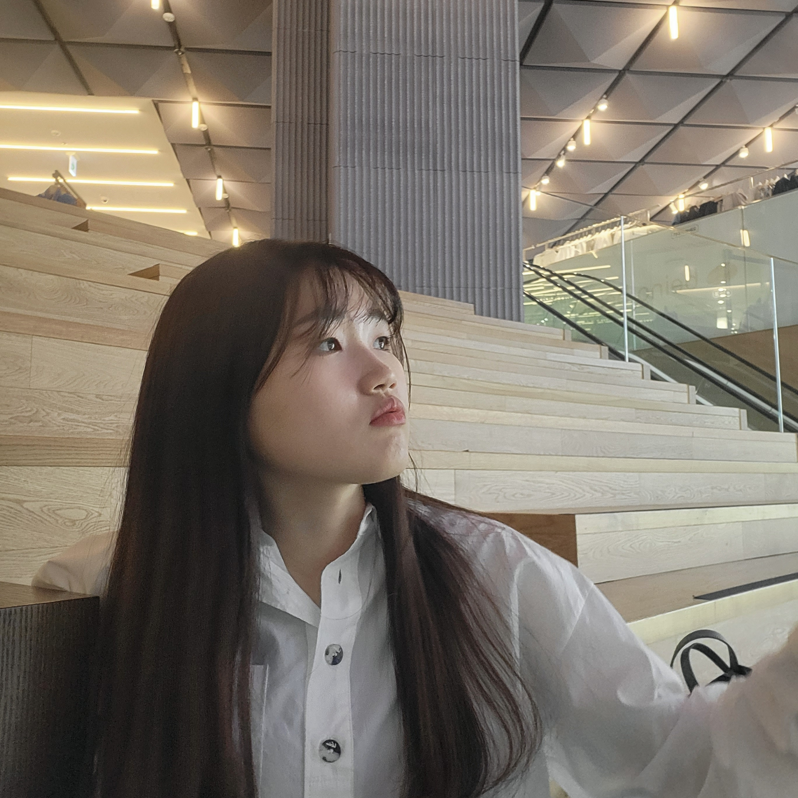

# CSI

CS-Interview

### ⏰ 스터디 시간 !

월 : 21시 

### 📄 스터디 규칙 !

3회 불참시 추방  
3회 안해오면 추방  
결석, 지각 미리 말해주기~~  
좋은 정보 서로 교환하며 취업해요~~ 🙂 

### 📣 스터디 방식 !

목요일까지 질문 1,2개 각자 올리기 (구글 문서에), 너무 추천하고 싶은 문제가 있다! (그러면 밑에 추천 문제로 작성해주세요)  
월요일에 만나면   
전주차 어려운 문제, 응답 못했던 문제를 재응답 (30분)  
랜덤 한명 발표(봇 추첨 - 바로 직전만 아니면 된다.)  
한 문제씩 서로 답하면서 정리로 가는 건가.  

월 : 스터디 진행 하면서  질문 작성, 문서 정리(노션과 같이)    
화,목 : 해당 주차 맡은 질문들 정리해서 깃허브 리드미에 정리 해서 올리기. 프로젝트 이슈 닫기    
목: 질문 사항 업로드     
토~월 : 공부    

### 🗓️ 각 주차별 계획

1 주차 : [자바/스프링/JPA 9/25](https://mon0mon-outline.duckdns.org/s/c43e8aa5-e19f-4c0e-b547-eb408efb4726)\
2 주차 : 자바/스프링/JPA 10/9  
3 주차 : 데이터 베이스 10/16  
4 주차 : 알고리즘 / 자료구조 10/23  
5 주차 : 네트워크 10/30  
6 주차 : 네트워크 11/06  
7 주차 : 운영체제 11/13  
8 주차 : 운영체제 11/20  

### 👥 팀원 소개

<table>
  <tbody>
    <tr>
        <td align="center"> 팀원 </td>
        <td align="center"> 팀원 </td>
        <td align="center"> 팀원 </td>
        <td align="center"> 팀원 </td>
        <td align="center"> 팀원 </td>
    </tr>
    <tr>
     <td>  </td>
     <td>  </td>
     <td>  </td>
     <td>  </td>
     <td>  </td>

</tr>
    <tr>
      <td align="center"><a href="https://github.com/YunByungil"> 윤병일 </a></td>
      <td align="center"><a href="https://github.com/mon0mon"> 이민기 </a></td>
      <td align="center"><a href="https://github.com/dlrjs2360"> 이희건 </a></td>
      <td align="center"><a href="https://github.com/Hyunmok-Chung"> 정현목</a></td>
      <td align="center"><a href="https://github.com/juhee77"> 박주희 </a></td>
    </tr>
  </tbody>
</table>

### 🔗 참고 사이트

[https://github.com/gyoogle/tech-interview-for-developer](https://github.com/gyoogle/tech-interview-for-developer)  
[https://github.com/JaeYeopHan/Interview_Question_for_Beginner](https://github.com/JaeYeopHan/Interview_Question_for_Beginner)  

# 📌 Computer Science
### 🎯 자바

- [Garbage Collector에 대해 설명해주세요 (java에서 GC는 어떻게 동작하나요)](./Computer%20Science/Java/[Java]%20Garbage%20Collector에%20대해%20설명해주세요/index.md)
- 제네릭에 대해 설명해주세요
- [== 연산과 Object.Equals() 연산의 차이에 대해서 설명해주세요](./Computer%20Science/Java/[Java]%20==%20연산과%20Object.Equals()%20연산의%20차이에%20대해서%20설명해주세요/index.md)
- 자바에서 Literal String을 쓰는 것과 new String()으로 생성하는 것의 차이에 대해서 설명해주세요
- 접근 제어자란 무엇이며 접근 제어자의 종류와 각각의 접근 범위를 설명해주세요
- [extends implements 차이를 설명해주세요](./Computer%20Science/Java/[Java]%20extends%20implements%20차이를%20설명해주세요/index.md)

### 🎯 JPA

- Spring JPA에서 엔티티의 생명주기에 대해 설명해주세요.
- JPA가 무엇인가요?

# 📌 Web

### 🎯 Spring

- 예시 질문