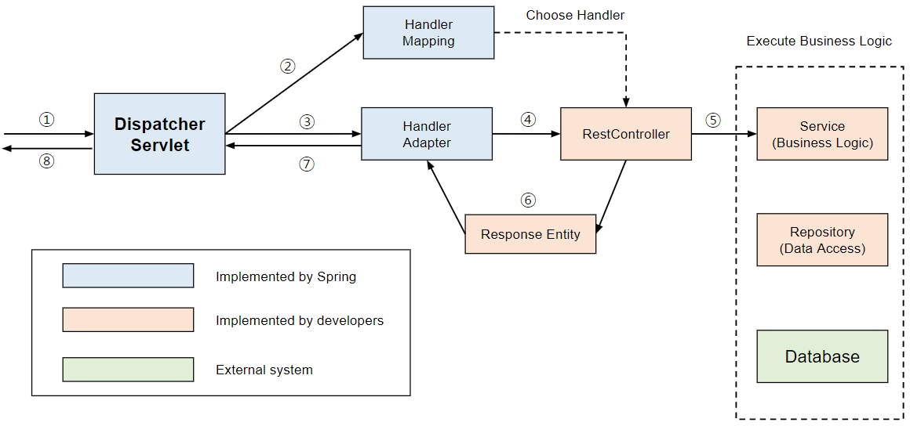

디스패처 서블릿은 HTTP 프로토콜로 들어오는 요청을, 이에 해당하는 컨트롤러에게 전달하는 역할을 합니다.

톰캣과 같은 서블릿 컨테이너가 요청을 받으면, 내부적으로 디스패처 서블릿이 처리를 담당하게 됩니다.

이러한 디스패처 서블릿의 장점은 크게 2가지가 존재합니다.

1. web.xml로 컨트롤러를 매핑 할 필요가 없어짐
2. 정적 자원과 동적 자원의 분리

디스패처 서블릿의 동작 과정은 다음과 같습니다.

1. 클라이언트의 요청을 디스패처 서블릿을 받음
2. 요청 정보를 통해 요청을 위임할 컨트롤러를 찾음
3. 요청을 컨트롤러로 위임할 핸들러 어댑터를 찾아서 전달함
4. 핸들러 어댑터가 컨트롤러로 요청을 위임함
5. 비지니스 로직을 처리함
6. 컨트롤러가 반환값을 반환함
7. 핸들러 어댑터가 반환값을 처리함
8. 서버의 응답을 클라이언트로 반환함